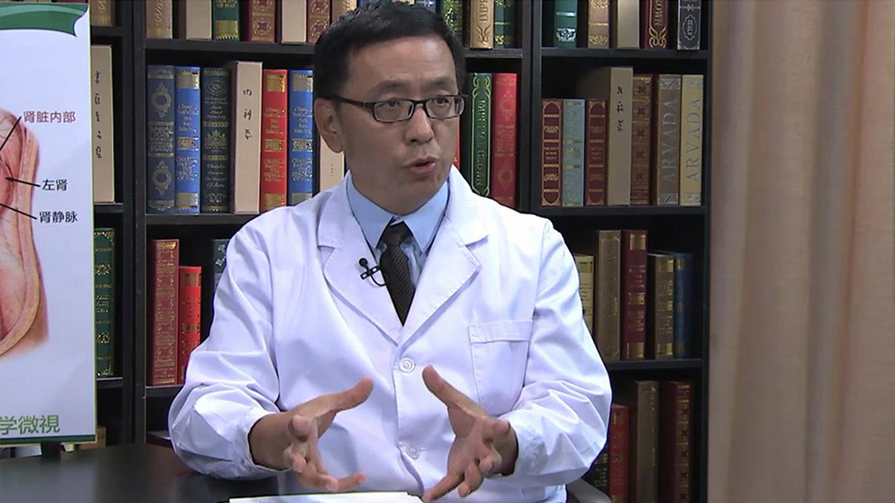

# 8.51 肾移植

---

## 张小东 主任医师

首都医科大学附属北京朝阳医院泌尿肾病中心主任 泌尿外科主任 主任医师 博士生导师。

享受国务院特殊津贴专家；首都医科大学泌尿外科研究所所长；中华医学会器官移植分会委员；北京医学会器官移植分会副主任委员；中国肾移植科学登记管理委员会副秘书长。

**主要成就：** 2012年获中华医学科技奖一等奖；先后主持国家自然基金3项;发表专业论著100余篇，主编《肾移植治疗学》及《移植肾病理学》，参编《黄家驷外科学》《吴阶平泌尿外科学》等专著。

**专业特长：** 擅长肾移植的外科手术及并发症的处理，并对致敏受者的处理进行了大量的研究。从事泌尿外科专业近30年，对肾癌、尿路上皮肿瘤、睾丸肿瘤等诊断及治疗有着丰富的经验。

---
