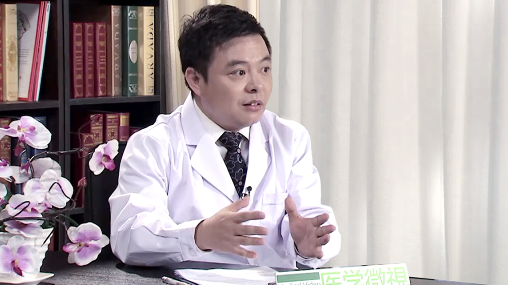

# 8.53 肾脏透析

---

## 史振伟 主任医师

应急总医院（原煤炭总医院）肾病医学中心主任 主任医师 硕士研究生导师。

国家食药监总局评审专家； 国家食药监总局体外循环技术委员会副主任委员； 国家食药监总局审评中心专家委员会特聘专家； 国家技术标准专家委员会委员； 中国医院管理学会血液净化中心管理分会委员； 中国医院管理学会血液净化中心管理分会血管通路学组委员； 中国医院管理学会血液净化分会委员； 中国医院管理学会血液净化血管通路学组委员； 中国非公立医疗机构协会肾病透析专业分会委员； 北京医师协会血管通路专业委员会常务委员； 北京生物医学工程学会委员； 北京市生物医学工程学会血管通路学组委员； 北京生物医学工程学会委员； 海峡两岸医学工作者学会血液净化分会常委； 《生物医学工程与临床杂志》编委 《中国组织工程研究与临床康复杂志》编委 。

**主要成就：** 在血液透析急、慢性并发症的诊断治疗、肾脏病有创操作如内瘘制作、深静脉置管、肾穿刺，尤其是血管通路的制作及并发症治疗方面有丰富的临床和科研经验，成功实施血管通路手术2000余例；并率先开通全国首家24小时血液透析血管通路绿色急救通路，24小时急诊透析绿色通路；在SCI收录期刊、核心期刊发表论文二十余篇；主编、参编《血液净化学》第三版、《透析与肾移植手册》、《血液净化模式及其临床应用》、《肾脏病药物治疗学》、《血液/浆吸附》、《肾病饮食调养100招》等著作6部。

**专业特长：** 擅长肾病及血液净化的临床、 教学及科研工作。在原、继发性肾小球疾病（如狼疮性肾炎、 糖尿病肾病及高血压肾损害等）及肾小管间质性疾病，急慢性肾功能不全等疾病的诊治等方面积累了大量的临床工作经验。

---
