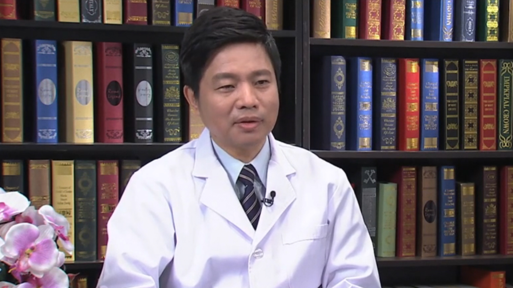

# 8.54 肾脏移植与捐献

---

## 蔡明 主任医师

解放军第309医院全军器官移植研究所副所长 ；解放军第309医院泌尿外科主任 主任医师 博士研究生导师。

享受国务院政府特殊津贴；享受军队优秀专业技术类岗位津贴；解放军器官移植专业委员会主任委员；中国免疫学会移植免疫学分会副主任委员 ；中国研究型医院学会器官移植专业委员会副主任委员；中国医师学会器官移植学分会常委；中华医学会器官移植学分会委员；中国免疫学会移植免疫学分会副主任委员。

**主要成就：** 发表论文130余篇，参加编写著作20余部；荣获国家科技进步二等奖项1项、华夏科技进步一等奖1项、中华医学科技一等奖1项、军队医疗成果一、二等奖各2项等。

**专业特长：** 从事器官移植基础与临床研究30余年 ，擅长于肾脏移植和肝脏移植手术以后及术前术后处理、免疫抑制剂调整和活体供肾的腹腔镜摘取手术;主刀完成肾脏，肝脏和胰肾，肝肾等联合移植共约2000余例。

---
