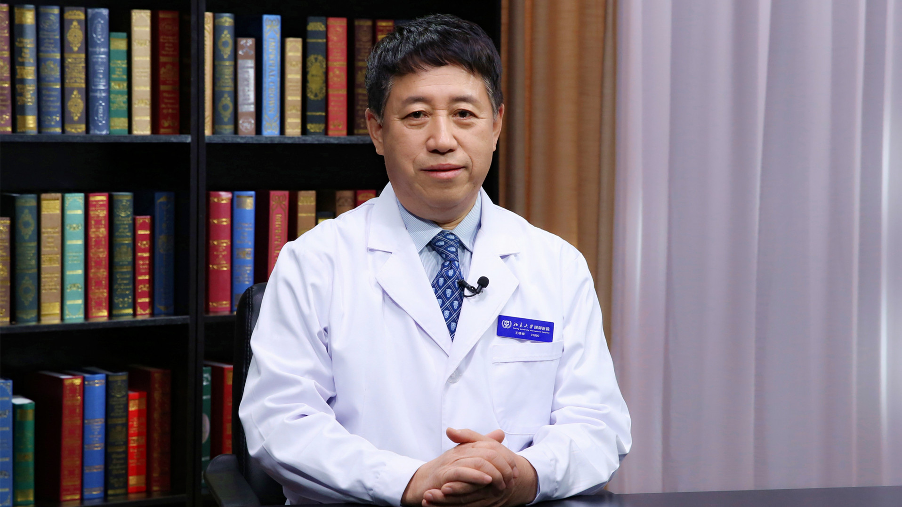

# 8.56 无痛性肉眼全程血尿

---

## 王晓峰 主任医师

北京大学国际医院泌尿外科主任 主任医师 博士生导师。

原北京大学人民医院泌尿外科主任、中华医学会男科学分会主任委员、中华医学会泌尿外科学分会常务委员、中华医学会泌尿外科学分会男科学组组长、中国医师协会泌尿外科医师分会委员、中国抗癌协会泌尿男生殖系肿瘤专业委员会常务委员、北京泌尿外科专业委员会副主任委员、北京器官移植专业委员会常务委员、北京抗癌协会泌尿男生殖系肿瘤专业委员会副主任委员。

**主要成就：** 荣获中华医学会泌尿外科学分会颁发的“砖石奖”和“伏羲奖”；发表科研论文200余篇。

**专业特长：** 从事泌尿外科、男科和肾脏移植工作三十余年，成功完成各种泌尿外科手术近万例。擅长诊治疑难复杂的肾癌、输尿管癌、膀胱癌、前列腺癌、前列腺增生、肾上腺疾病、泌尿系结石和男性勃起功能障碍等疾病。

---
