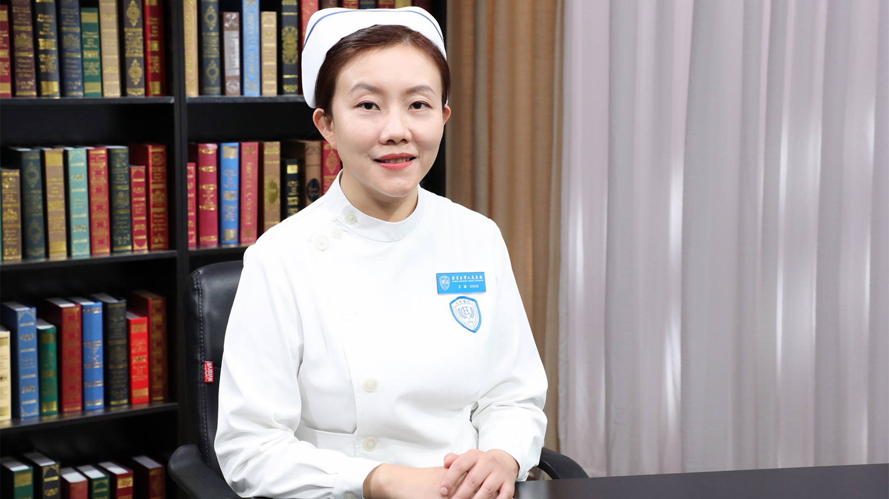

# 8.59 血液透析患者的护理

---

## 王颖 副主任护师

北京大学人民医院血液净化中心副护士长 副主任护师。

中华护理学会血液净化护理专业委员会秘书兼委员；北京市西城区血液净化质量控制委员会护理专家。

**主要成就：** 以第一作者、通讯作者在核心期刊发表论文十余篇，完成护理科研基金课题2项，在研1项。

**专业特长：** 擅长血液透析室的护理管理，此外在血液透析患者的营养、运动、心理、血管通路健康管理上积累了丰富的临床经验。

---
