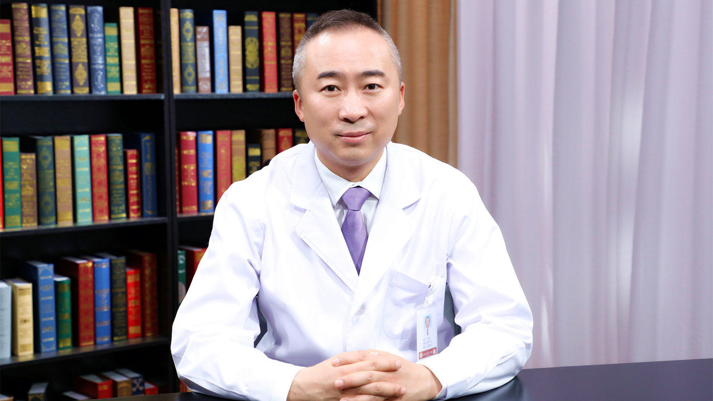

# 8.60 遗传性肾癌

---

## 龚侃 主任医师

北京大学第一医院泌尿外科主任医师 博士生导师。

中华医学会泌尿外科学分会肿瘤学组委员；中国医师协会泌尿外科医师分会肿瘤专业委员会委员；中国抗癌协会家族遗传性肿瘤专业委员会常务委员；北京医学会肿瘤委员会委员；北京医学会罕见病分会泌尿外科学组组长；中国前列腺癌诊断治疗指南编委。

**学术成就：** 主持多项国家及部委级基金；在Cancer Research、Genetics in Medicine等国际著名肿瘤学和遗传学杂志发表SCI论文50余篇；荣获中华医学科技奖和教育部科技进步奖等多项奖项；入选科技部“中青年科技创新领军人才”和第三批中组部 “国家高层次人才特殊支持计划（万人计划）”。

**专业特长：** 擅长泌尿系统肿瘤及复杂良性前列腺增生症的诊治，包括：前列腺癌规范化全程诊断治疗（机器人/腹腔镜前列腺癌根治性切除术等）；疑难性散发性/遗传性肾癌诊断治疗（机器人/腹腔镜肾癌根治性切除术、遗传性肾癌如VHL综合征和BHD综合征等规范化诊疗等）；膀胱癌、肾盂/输尿管癌、肾上腺肿瘤的诊疗（腹腔镜膀胱癌根治性切除及尿流改道术、腹腔镜肾上腺肿瘤切除术等）；良性前列腺增生的微创手术和药物治疗等。

---
