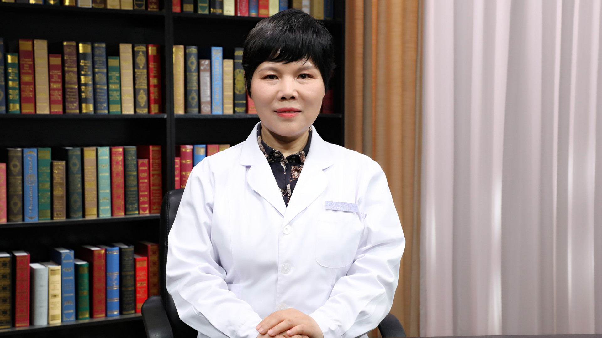

# 8.63 中医治疗慢性肾衰竭

---

## 柳红芳 主任医师

北京中医药大学东直门医院首席专家 肾病研究所执行所长 肾病内分泌科一区主任医师 教授 博士生导师。

中华中医药学会肾病分会副主任委员 秘书长 中华中医药学会糖尿病分会常委委员；中国中医药研究促进会仲景医学研究分会副会长；中国中医药信息学会张仲景研究分会副会长；中国医疗保健国际交流促进会中老年保健专业委员会专家委员；世界中联中药上市后再评价专业委员会第一届理事会理事；国家自然科学基金项目评审专家。

**主要成就：** 发表学术论文100余篇，编写学术专著7部；先后承担2项国家自然科学基金，北京市重大科技攻关项目、北京市科学技术委员会“十病十药”课题、首都特色课题等国家级、省部级科研课题20余项；荣获中华中医药学会科学技术一等奖、二等奖、三等奖等多项奖励，“一种治疗糖尿病肾病的中药组合物及其制备方法”获得国家发明专利，“糖尿病进展为糖尿病肾脏病风险预测系统”和“糖尿病肾脏疾病进展的中西医结合预测系统”获得软件著作权专利；荣获北京中医药大学东直门医院首届“十佳医师”“第三批全国优秀中医临床人才”“首都中青年名中医”“北京市优秀中青年医师”称号。

**专业特长：** 擅长治疗糖尿病肾病、慢性肾病蛋白尿、痛风性肾病、慢性肾衰竭、甲状腺疾病、复杂性尿路感染等疾病。

---
