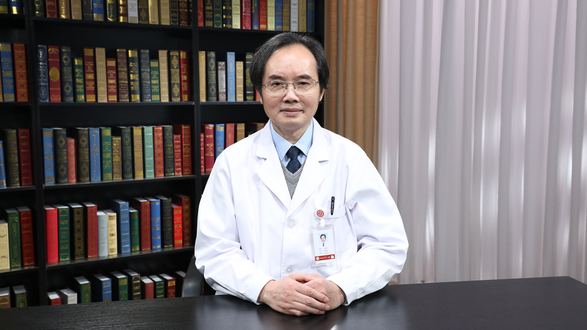

# 9.1 白血病的检验诊断

---

## 王建中 主任医师

北京大学第一医院检验科主任医师 研究生导师。

检验医学住院医师培训项目委员会主席兼基地主任；中国医师协会检验医师分会常务委员；中国医师协会检验医师分会造血与淋巴组织肿瘤检验医学专家委员会主委；世界华人检验与病理医师协会常务委员；北京市临床检验中心血细胞检验诊断专家委员会副主任委员；《检验医学》杂志等专业期刊杂志编委。

**主要成就：** 最早在中国大陆开展医学检验专业住院医师规范化培训工作；主编《实验诊断学》等多部国家级规划教材；主编《临床检验诊断学图谱》和《临床流式细胞分析》等多部学术专著；主编国家卫生健康委员会住院医师规范化培训教材《临床检验医学》。在国内外医学专业刊物上发表论文70余篇，获国家教育部科技进步二等奖（第一完成人）等多个奖项，多次获北京大学医学部优秀教师奖。

**专业特长：** 从事实验诊断学、临床血液学检验的医疗、教学和科研工作30多年；擅长临床血液学检验诊断和临床流式细胞分析与应用，对疑难造血与淋巴组织肿瘤、血小板病及相关疾病的检验诊断有丰富的临床经验。

---
