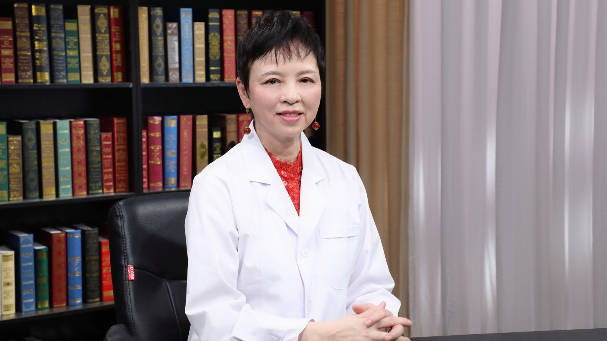

# 9.2 CAR-T细胞疗法

---

## 陆佩华 主任医师

陆道培医院医疗执行院长 主任医师  清华大学（医学院）-北京陆道培血液病研究院院长。

中国非公立医疗机构协会第一届常务理事；中国非公立医疗机构协会血液病专业委员会主任委员；中国非公立医疗机构协会生物技术与细胞应用专业委员会常务委员；中国造血干细胞捐献者资料库专家委员会委员；中国临床肿瘤学会（CSCO）抗白血病联盟专家委员会常务委员；中国抗癌协会第一届血液病转化医学专业委员会常务委员。

**主要成就：** 曾在国际知名学术杂志发表多篇论文，先后获得了多个美国国立卫生研究院（NIH）的奖项，包括个人的博士后研究奖及医生科学家奖（KO11）；于2015年回国，回国后主导了多项工作及研究，在细胞免疫治疗如CART治疗、淋巴瘤、骨髓瘤及白血病等多领域有深入的研究及丰富的临床经验。

**专业特长：** 擅长细胞免疫治疗，在CAR-T治疗淋巴瘤、骨髓瘤及白血病等多领域有深入的研究及丰富的临床经验。

---
