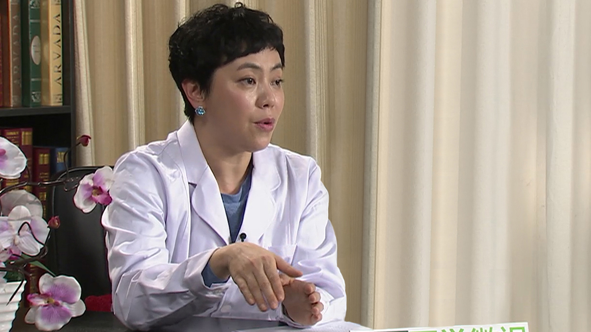

# 9.5 儿童白血病舒缓治疗

---

## 周翾 主任医师

首都医科大学附属北京儿童医院血液肿瘤中心知名专家 主任医师。

中华医学会儿科学分会血液学组儿童舒缓治疗亚专业组组长。

**主要成就：** 近五年以第一作者及通讯作者在国内核心期刊发表文章十余篇；主持局级科研项目一项，并以主要参加者参与国家级课题，2011年获得首都医科大学学生实践创新能力培养项目课题，2010年获北京市卫生局十百千人才“百”人才，2012年获北京市优秀中青年医师称号。

**专业特长：** 擅长包括儿童白血病在内的各类血液系统疾病的诊治，目前研究方向为儿童舒缓治疗，对治疗中的病人进行疼痛等症状管理，对患儿及家长给予心理疏导，并举办各种志愿者活动，从而提高病人的生存质量。

---
