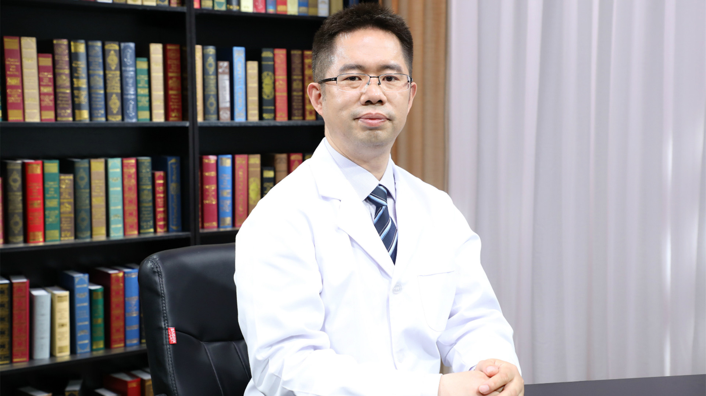

# 9.6 恶性淋巴瘤的病理检查

---

## 钟定荣 主任医师

中日友好医院病理科主任 支部书记 主任医师 硕士研究生导师。

西藏自治区医学会病理诊断质控中心副主任；北京肿瘤病理精准诊断研究会会长；中国病理学工作者委员会第四届副主任委员；中国医学装备协会病理装备技术专业委员会常务委员兼副秘书长；中国医疗保健国际交流促进会病理学会常务委员兼秘书长；中国病理学工作者委员会淋巴瘤学组委员。

**主要成就：** 世界上首次提出一个软组织肿瘤新亚型并发表文章，获得国际同行认可；诊断了世界首例血清HIV抗体阴性但高病毒拷贝的肺原发性卡波西肉瘤，发表文章得到同行认可；发表专业文章100余篇，主编、副主编及参编书籍共8本；发起并成立了基于MDT的跨界性一级学会“北京肿瘤病理精准诊断研究会”（担任首任会长）。

**专业特长：** 擅长肿瘤病理诊断，在淋巴瘤、软组织肿瘤和中枢神经系统方面尤为突出。

---
