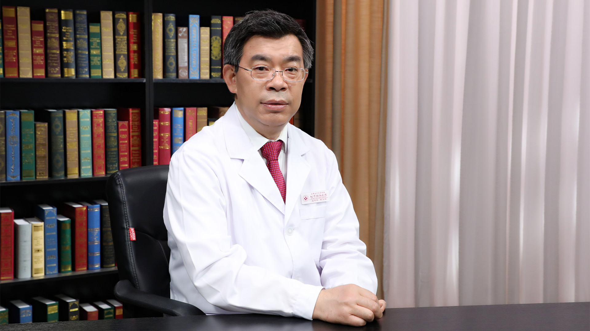

# 9.8 过敏性紫癜

---

## 陈文明 主任医师

首都医科大学附属北京朝阳医院血液科主任 主任医师 教授 博士生导师。

首都医科大学血液病学系主任；中华医学会血液学分会造血干细胞移植学组成员；中国医师协会血液科医师分会委员；中国医师协会血液科医师分会多发性骨髓瘤专业委员会副主任委员；中国医师协会整合血液病学专业委员会委员；北京市多发性骨髓瘤医疗研究中心主任。

**主要成就：** 北京市卫生系统“215”高层次卫生技术人才队伍学科带头人；先后获国家科技重大专项2项（组长、副组长）；获得国家自然科学基金、北京市自然科学基金等10余项资助；发表学术论文200余篇，主编专著3部，主译专著1部，主编教材2部，参编教材2部，参编专著2部。

**专业特长：** 擅长多发性骨髓瘤、各型血液系统良恶性疾病、血栓与出血性疾病、造血干细胞移植等。

---
