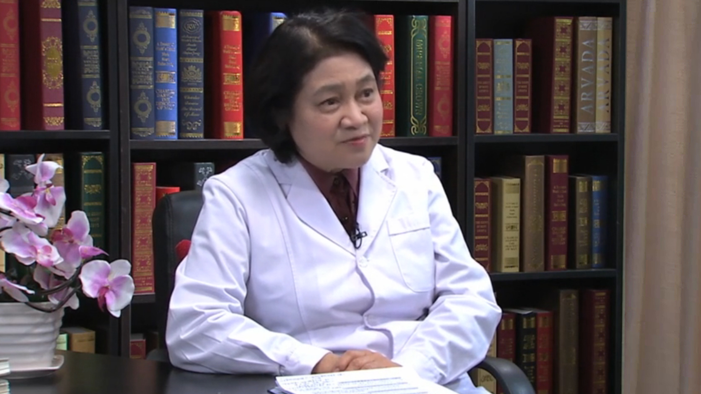

# 9.10 急性白血病

---

## 江滨 主任医师

**北京大学人民医院血研所副所长 主任医师** ；北京大学国际医院血液科常务副主任；中国免疫学会理事；中国免疫学会血液免疫分会前任主任委员；中国抗癌协会血液肿瘤分会常委；卫生部药品不良反应专家委员会专家；国家食品药品监督管理总局新药审评中心兼药品再评估中心专家。

**主要成就：** 参与和主持多项国自然、211等科研项目，荣获中华预防医学会科学技术奖二等奖；：参与多部血液病诊疗指南的制订；参与高校统编教材《内科学》白血病章节的编撰；主编与参编《白血病》《淋巴瘤》《多发性骨髓瘤》专著。

**专业特长：** 从事血液专业30余年，主要专业方向为血液系统恶性肿瘤的诊断与治疗，尤其擅长急性白血病、慢性粒细胞白血病、MPN、MDS、CMML和多发性骨髓瘤的诊治。

---
