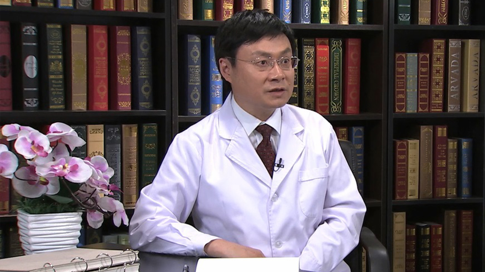

# 9.12 淋巴瘤的放射治疗

---

## 李晔雄 主任医师

中国医学科学院肿瘤医院放疗科主任 主任医师。

中华医学会放射肿瘤学分会第八届主任委员；中华医学会肿瘤学分会委员；中国抗癌协会临床肿瘤研究协会（CSCO）常委；中国抗癌协会淋巴瘤专业委员会常委；中国抗癌协会肿瘤放射治疗专业委员会常委；北京医学会肿瘤学分会第九届副主任委员；北京医学会放射肿瘤学分会常委；北京抗癌协会肿瘤放疗专业委员会委员。

**主要成就：** 2011年中国抗癌协会科技奖二等奖，2011年北京市科学技术奖二等奖，2011年中华医学科技奖二等奖；2012年中华医学科技奖二等奖，2012年北京市科学技术奖三等奖，2014年第十五届吴阶平-保罗•杨森医学药学奖；发表论文和综述170余篇，第一作者或责任作者50余篇。在国外重要英文杂志发表论文50余篇，影响因子最高为18.97。

**专业特长：** 擅长恶性肿瘤的放射治疗，应用放射治疗作为早期结外鼻型NK/T细胞淋巴瘤的主要治疗手段，生存率居国际领先水平。应用单纯放疗治疗早期低度恶性淋巴瘤如滤泡淋巴瘤、粘膜相关淋巴瘤等取得了很好的治疗效果，应用图像引导放疗（IGRT）、调强放疗（IMRT）和三维适形放疗（3D-CRT）等最新放疗技术治疗前列腺癌、淋巴瘤等恶性肿瘤，提高了生存率，其它临床开创性工作包括直肠癌术前和术后同步放化疗，乳腺癌保留乳房术后放疗，早期睾丸或隐睾精原细胞瘤的放疗等。

---
