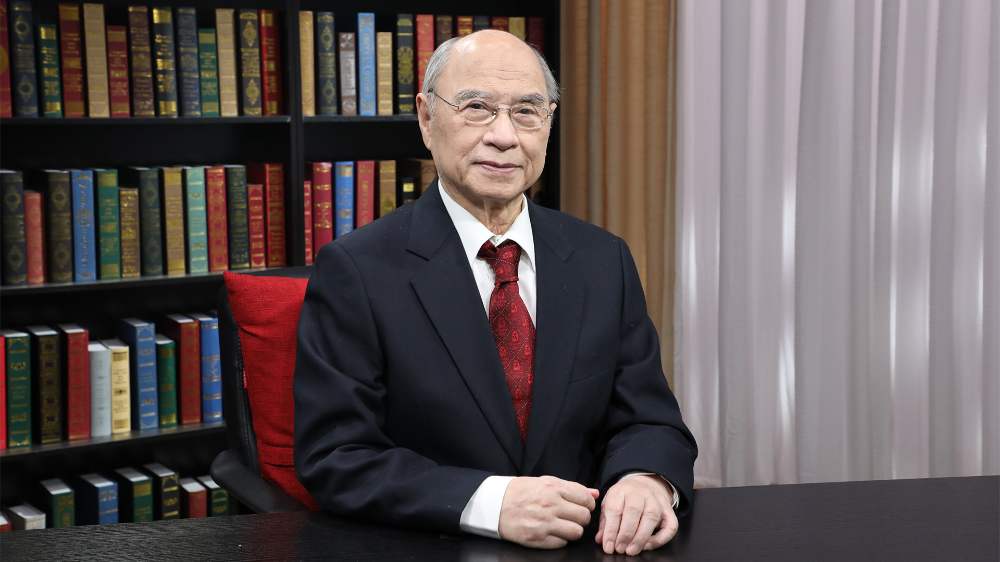

# 9.20 血液病常识

---

## 陆道培 院士

前中华医学会副主席；中华医学会血液学分会名誉主席；中华造血干细胞合作组发起人；亚洲血液学会（AHA）副主席；前北京大学人民医院血液病研究所所长；陆道培医疗集团创始人 医学总监；北京大学与复旦大学教授。

**主要成就：** 1964年成功完成亚洲第一例同基因骨髓移植；1981年率先在中国成功植活异基因骨髓；1992年参与筹建中华骨髓库；1997年建立了中国首个国家批准的脐带血库；2007年倡导成立了中华造血干细胞移植学会（CSBM）；2016年荣获CIBMTR（国际血液与骨髓移植研究中心）“杰出服务贡献奖”；先后荣获国家科学技术进步二等奖、中华医学会科技进步二等奖等多项奖励；已发表文章400余篇/部论著，包括主编《白血病治疗学》等4部专著，参与编写19部著作。

**专业特长：** 擅长血液系统疾病的诊断和治疗。

---
