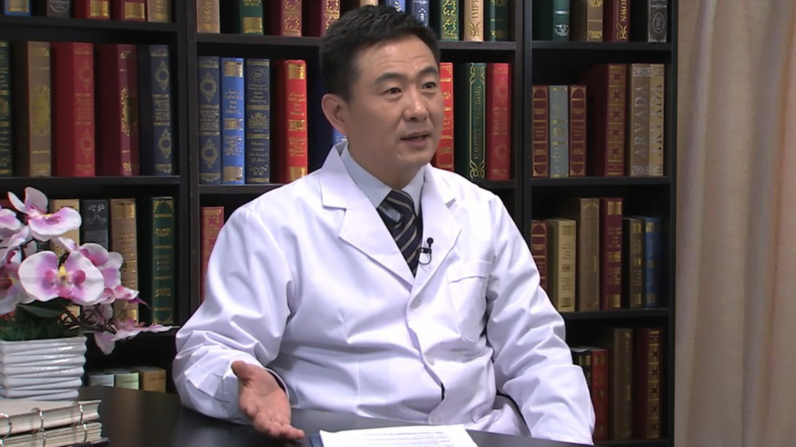

# 9.22 原发性中枢神经系统淋巴瘤

---

## 刘元波 主任医师

首都医科大学附属北京天坛医院血液科主任 医学博士 主任医师 教授 博士生导师；北京市海聚工程人才 北京市特聘专家；中华医学会北京血液学分会委员；中国研究型医院医院学会血液病精准诊疗专家委员会常务委员。

**主要成就：** 完成NIH及国家自然基金等课题十余项，在Cancer Reserch, Clinical Cancer Research, PNAS等国际著名期刊发表论文20余篇。主要成果：1.作为负责人主持完成国内首例异体外周血干细胞移植治疗重症再生障碍性贫血，病人已经存活17年。2.证明肌肉注射腺相关病毒AAV1载体在治疗血友病动物的有效性，为临床治疗实验奠定基础。3.发现细胞表面HER2受体及ACK1非受体激酶在前列腺肿瘤发病中的关键作用，为新的靶向治疗新药的研制提供了重要实验依据。4.证明治疗白血病的新药Dasatinib能有效抑制前列腺肿瘤细胞生长，为拓展该药的临床应用范围作出有益贡献。

**擅长：** 1.中枢神经系统淋巴瘤化疗及生物靶向治疗；2.血液肿瘤综合治疗及个体化治疗；3.肿瘤患者早期自身造血干细胞储存与移植的意义；4.风湿免疫性疾病对血液系统影响。

---
