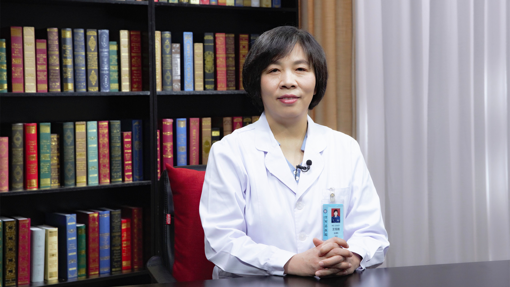

# 9.23 再生障碍性贫血

---

## 王恒湘 主任医师

空军军医大学空军特色医学中心血液科主任 主任医师 博士生导师。

全军血液病专业委员会常委；全国造血干细胞移植协会委员；北京医师协会常务理事；北京医学会血液学分会委员；中华血液学杂志特邀审稿专家。

**学术成就：** 发表论文50多篇；获军队科技进步奖和临床医疗成果奖及北京市临床成果和中华医学奖共7项。

**专业特长：** 擅长造血干细胞移植，尤其是造血干细胞移植治疗再生障碍性贫血、骨髓增生异常综合征、白血病等。

---
