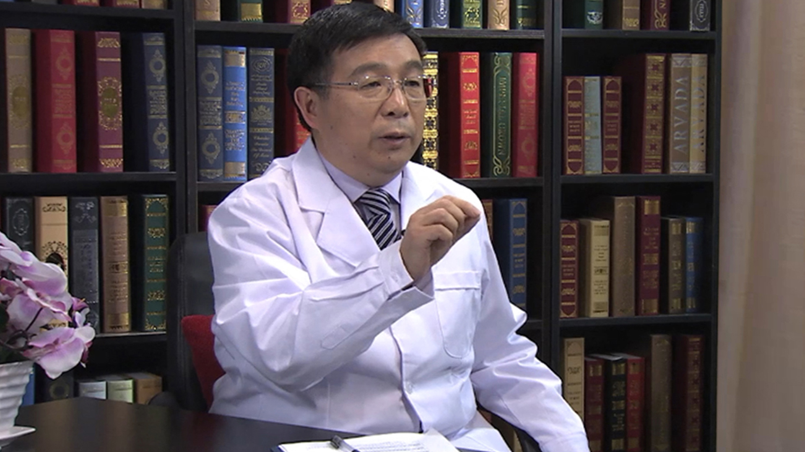

# 9.24 造血干细胞移植

---

## 任汉云 主任医师

北京大学第一医院血液科主任 主任医师 知名血液病专家 教授 博士研究生导师.

中华医学会血液学分会常务委员；中华骨髓库专家委员会副主任委员；中国老年协会老年淋巴瘤分会副主任委员；中国抗癌协会血液肿瘤专业委员会常务委员；中国淋巴瘤联盟常务委员；海峡两岸血液学会常务委员。

**主要成就：** 2005年获得中国医师学会中国医师奖；承担十余项国家级课题的研究工作；在国内外学术期刊上发表论文100余篇。

**专业特长：** 擅长白血病、淋巴瘤和多发性骨髓瘤等血液系统疾病的诊断和治疗，在造血干细胞移植方面有很深的造诣，主持各类造血干细胞移植1000余例，长期生存率达国内外领先水平，并成功实施了国内首例成人脐血移植和国内第一例应用半相合造血干细胞移植治疗遗传脑病，在血液学界有较大影响。

---
