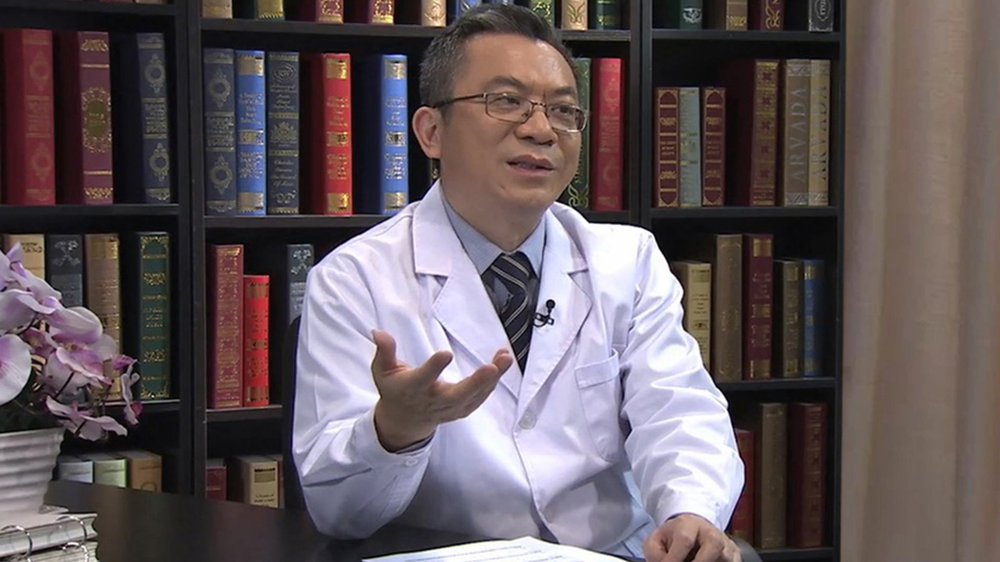

# 9.25 造血干细胞移植后的抗宿主病

---

## 黄晓军 主任医师

北京大学人民医院血液科主任 主任医师。

中国研究型医院学会细胞研究与治疗专业委员会主任委员；中华医学会血液学分会前任主任委员；亚太细胞治疗学会主席；《中华血液学杂志》总主编；亚太血液联盟常委会主任；美国血液学会国际常委会委员；J Hematol & Oncol副主编；British J Hematol副主编。

**主要论文及编著：**主编著作15本；以通讯或第一作者发表SCI论文270余篇，包括New Engl J Med（2篇Letter）、Blood（10篇）、BBMT和BMT（61篇）等，入选2014、2015年中国高被引学者榜单（医学）。

**专业特长：** 擅长血液系统疾病的诊治，对急性早幼粒白血病(APL)的治疗模式进行了改进；建立完善多项造血干细胞移植关键通用技术，如白血病复发及抗宿主病新型防治体系，使北京大学人民医院成为全球数量最多、疗效领先的异基因造血干细胞移植中心；开创、发展和完善并逐渐形成国际原创单倍体移植体系（北京方案），取代经典相合移植使单倍体供者成为我国第一供者来源，输出欧美、日韩应用，占全球单倍体移植50%以上，从而基本上解决了造血干细胞移植供者来源匮乏问题。

---
