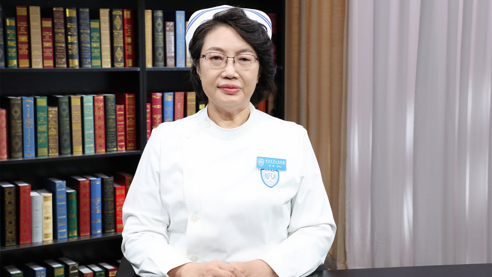

# 9.26 造血干细胞移植患者护理

---

## 颜霞 副主任护师

北京大学人民医院血液科总护士长。

北京护理学会血液专业委员会主任委员；中华护理学会内科专业委员会专家委员；亚太地区血液和骨髓移植协会（APBMT）护理主席；欧洲血液和骨髓移植协会（EBMT）护理委员会委员；《中华护理杂志》编委；《中国护理管理》杂志审稿专家。

**主要成就：** 2013年和2017年分别以项目第一完成人带领团队荣获北京市护理成果三等奖和优秀奖；2015年和2018年分别以第一发明人获实用新型专利1项；2017年荣获“首都优秀护理工作者”荣誉称号；2018年荣获欧洲血液及骨髓移植协作委员会颁发的“颜霞护理团队法国圣安东尼—EBMT杰出护理团队”及北京护理学会第三届护理科技进步奖优秀奖；2019年荣获“北京大学优秀党务和思想政治工作者”及北京大学医学部第六届“天使之星”荣誉称号；发表SCI论文4篇（IF=10.281）、其他论文50余篇及专著14部。

**专业特长：** 擅长血液系统、造血系统及造血干细胞移植疾病的护理及护理管理。

---

---
