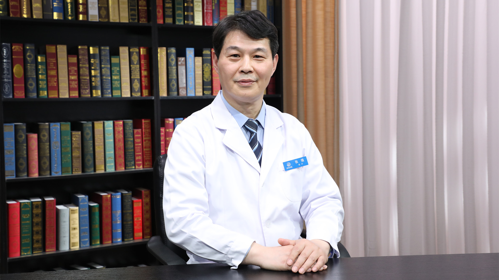

# 10.3 布病性脊柱炎//张强教授

---

## 张强 主任医师

首都医科大学附属北京地坛医院骨科主任 主任医师 教授 博士生导师。

中国性病艾滋病防治协会专家委员会外科学组组长；中华医学会热带病分会外科学组副组长；中国医药教育协会脊柱外科分会委员 感染学组副组长；中国康复医学会修复重建外科专业委员会骨缺损及骨坏死学组委员；中国康复医学会脊柱感染学组委员；中华医学会生物医学工程分会数字骨科学学组委员；中国康复医学会颈椎病学组委员；国际矫形与创伤外科学会（SICOT）中国部创伤学会委员；中国康复医学会脊柱脊髓损伤学组委员；中国康复医学会脊柱外科学组腰椎组委员；中国研究型医院学会脊柱外科专业委员会微创学组委员；手术与细胞治疗学术委员会委员。

**主要成就：** 发表论文80余篇，副主编专著3部，参编著作9部；作为主要完成人，主持开展国家和军队课题6项；先后获得国家和军队科技进步奖4项，获国家专利13项；目前承担各种课题4项。

**专业特长：** 主要研究方向为感染病相关骨科伤病、脊柱外科、创伤骨科、关节外科。

---
