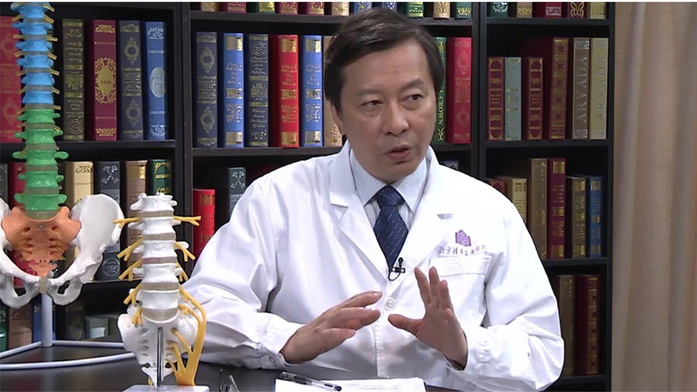

# 10.5 复杂腰椎退行性疾病

---

## 肖嵩华 主任医师

清华大学附属北京清华长庚医院骨科主任。

中国人民解放军第九届医学科学技术委员会骨科学专业委员会常务委员 秘书长 骨肿瘤分会顾问委员 脊柱外科分会委员；中国人民解放军医学科学技术第八届医学科学技术委员会骨科学专业委员会委员 脊柱外科分会副主任委员 骨肿瘤分会委员；中国康复医学会骨与关节及风湿病专业委员会脊柱非融合学组委员；中华医学会运动医疗分会脊柱运动损伤学组 副主任委员；中华医学会骨科学分会脊柱学组委员。

**主要成就：** 主持国家科技支撑计划项目：“战创伤后中枢神经损伤功能重建技术研究”，“活性纳米复合生物材料制品”等重大课题研究；2005年“创伤后股骨头缺血性坏死的治疗和系列研究”获国家科学技术进步一等奖；2006年“微创脊柱外科（脊柱结核、椎间盘突出、椎间隙感染等）系列研究”获解放军总医院科学技术成果二等奖；2009年“战创伤系列骨修复材料研制”获全军科技进步一等奖；在国际国内期刊发表论文100余篇。

**专业特长：** 擅长复杂疑难的颈胸腰椎退行性疾病（腰腿痛、颈肩痛、坐骨神经痛、间歇性跛行等）、脊柱微创治疗、脊柱肿瘤、上颈椎疾病、脊柱侧弯后凸畸形、颈胸腰椎外伤骨折脱位等。

---
