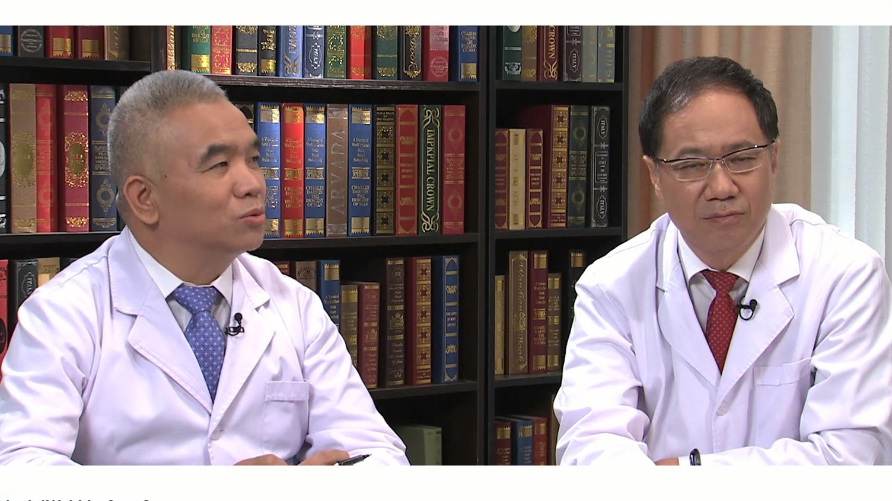

# 10.6 高龄脊柱疾病患者的麻醉与手术

---

## 王天龙、鲁世保 主任医师

**王天龙：** 首都医科大学宣武医院麻醉手术科主任 主任医师 博士生导师。

中华医学会麻醉学分会常务委员兼秘书长；中华医学会麻醉学分会老年人麻醉学组组长；中国医师协会麻醉医师分会常务委员；中国研究型学会麻醉专业委员会副主任委员；国家老年麻醉联盟（NAGA）主席；北京医学会麻醉学分会候任主任委员。

**主要成就：** 2016年获 “首都十大健康卫士”提名奖；获国家及省部级研究项目支持10余项，累计经费超过800万元；发表SCI论文40余篇，核心论文300余篇，致力于围术期脆弱脏器功能保护的基础与临床研究。

**专业特长：** 擅长老年患者麻醉，特别是高龄患者麻醉、神经外科麻醉、并存复杂疾病患者麻醉以及疑难危重患者麻醉与抢救；对老年患者脆弱脑功能保护具有突出优势，有效降低了老年患者术后严重脑部并发症的发生。

**鲁世保：** 首都医科大学宣武医院骨科主任 主任医师 博士生导师；首都医科大学骨外科学系副主任。

中华医学会北京市骨科分会常务委员；中华医学会创新与转化学组委员；中国老年学学会老年脊柱关节疾病专业委员会委员。

**主要成就：** 《中国脊柱脊髓损伤杂志》编委；在SCI期刊发表论文20篇，中文核心期刊50余篇；近年主持在研及完成国家自然科学基金面上项目共4项，完成省部级研究课题5项。

**专业特长：** 致力于脊柱相关疾病的治疗研究，形成了以老年脊柱畸形矫正、颈腰椎非融合技术以及颈腰椎微创技术为特色的三位一体诊疗平台。

---
