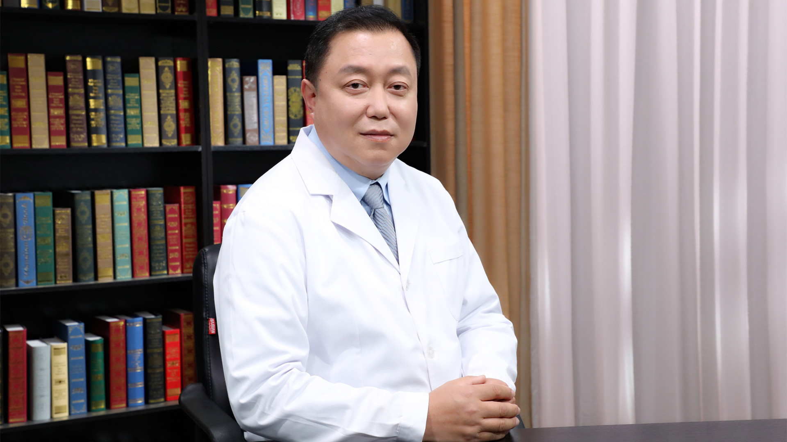

# 10.7 跟骨骨折

---

## 武勇 主任医师

北京积水潭医院足踝外科主任 主任医师；北京大学医学部教授 清华大学兼职教授。

中国康复医学会骨与关节分会足踝外科组主任委员；中国老年医学学会骨与关节分会足踝外科组主任委员；中国医疗保健国际交流促进会足踝学组副主任委员；中华医学会骨科学分会足踝外科学组全国委员会秘书。

**主要成就：** 1998年赴德国进修，并多次赴德国、美国、瑞士、泰国等地交流教学，现任国际骨内固定研究学会中国讲师团讲师；英语水平优秀，广泛接触国际先进的理论和临床经验，保持着领先的骨创伤治疗水准。

**专业特长：** 具有良好的医德医风、扎实全面的理论知识和深厚丰富的临床经验，在治疗四肢骨折、脊柱骨折、骨盆骨折、髋臼骨折、足踝外伤等方面有独到的经验和治疗方法；目前主要从事治疗足踝部创伤和非创伤性疾患，特别是对踝关节骨关节炎分期治疗、全踝关节置换等，具有十分专业和非常难得的经验和临床技术。

---
