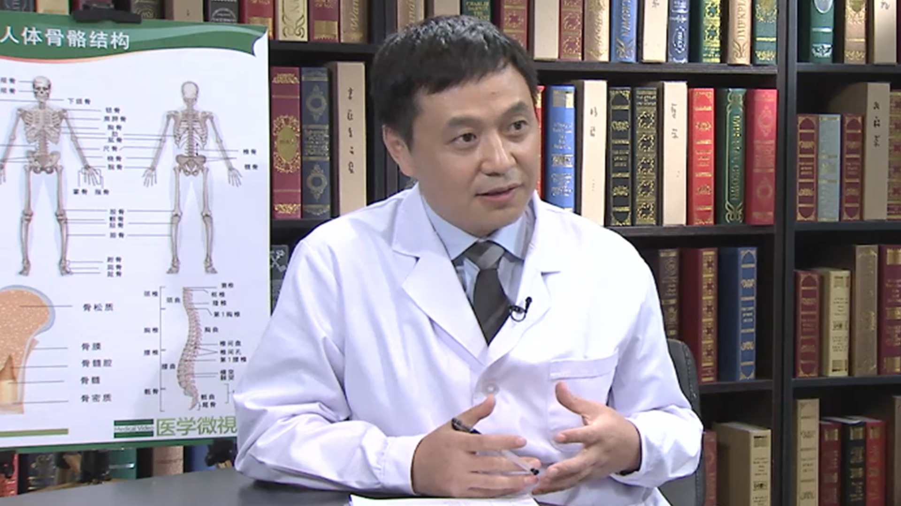

# 10.10 关节炎

---

## 周一新 主任医师

北京积水潭医院矫形骨科主任 主任医师 博士研究生导师 教授。

中华医学会骨科委员会关节学组委员兼秘书；中国医师协会关节外科委员会副主任委员；康复医学会骨与关节及风湿病委员会青年委员会主任委员；国际骨与关节感染学会委员；国际人工关节技术学会(ISTA)常务理事；SICOT骨与关节感染委员会创始委员；中国名医百强榜 Top 10关节外科医生。

**主要成就及论文编著：** 北京市科技新星，北京市卫生系统青年岗位能手；2003年入选北京市高级专家库，并获得北京市优秀人才专相研究基金资助；2011年入选北京市高级卫生人才工程（215工程）；参予设计了多款人工髋关节和膝关节系统及人工关节的辅助系统。是Anthem，A3等人工膝关节系统的主要设计者之一及 Orion，China Hip等人工髋关节系统主要设计者之一；近年来，在人工关节领域发表论文100篇，其中30篇发表于J.B.J.S(Am)，J.B.J.S(Br)， C.O.R.R, JOA 等著名期刊。

**专业特长：** 髋，膝，踝关节病，股骨头坏死，髋臼发育不良，成人下肢与足部畸形的治疗，擅长人工关节初次置换术与翻修术，擅长成人下肢畸形的矫正。

---
