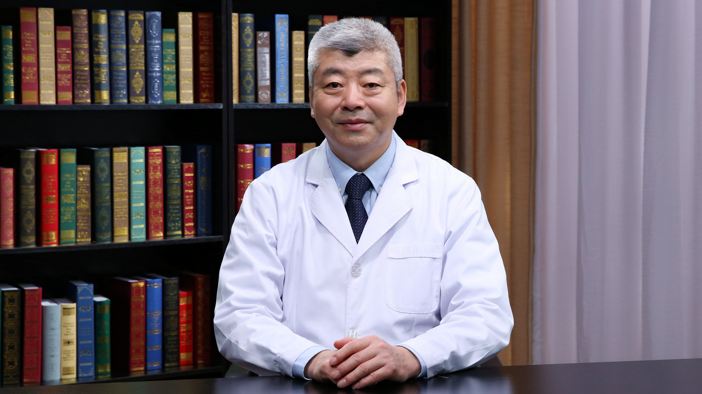

# 10.11 关节症状

---

## 郭晓忠 主任医师

北京积水潭医院矫形骨科资深知名专家。

国务院特殊津贴专家；中国医科大学航空总医院骨科中心首席专家；中国医科大学航空总医院骨关节科主任；中国医药生物技术协会计算机辅助外科技术委员会第一至第三届委员；中国生命关怀协会远程医学专业委员会常务委员；《中华损伤与修复杂志》编委。

**主要成就：** 完成髋、膝人工关节置换手术等各类手术数千例，尤其采用导航（智能化）进行人工关节置换术，更是全国一流水平；从事股骨头坏死临床和研究工作二十余年，采用“微创保头手术”技术，使许多股骨头坏死患者得到康复，是此领域最知名专家之一；发表多篇相关学术论文，并参与完成骨科领域著作六册，其中副主编一册；先后承担院级、市级课题3项，获得过省部级及北京市科技进步奖各一项。

**专业特长：** 擅长股骨头坏死的早期诊断与“保头”手术治疗，骨坏死晚期人工关节置换术，髋、膝关节骨关节病的诊断和手术治疗，各种骨科关节病和畸形的诊断和治疗以及各种骨科疑难杂症的诊断与治疗。

---
