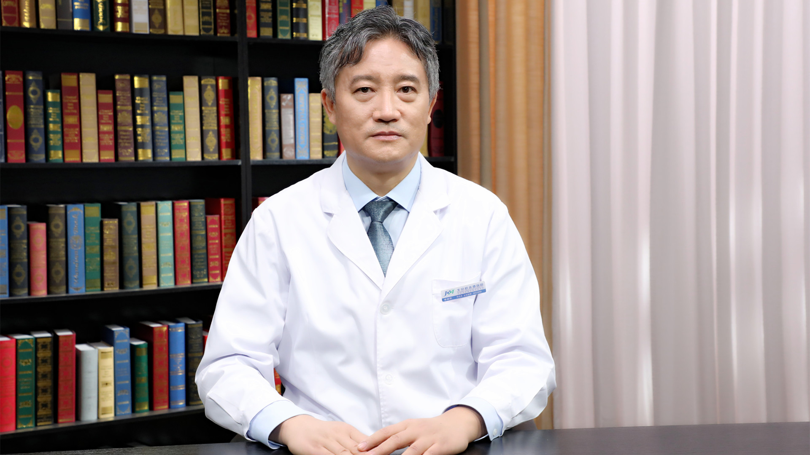

# 10.13 股骨头缺血性坏死的中医保守治疗

---

## 李建民主任医师

北京积水潭医院传统医学科主任 中医正骨科主任 主任医师。

中华中医药学会风湿病学会常务委员；北京中医药学会骨伤科专业委员会副主任委员；北京中医药学会理事会理事。

**专业特长：** 在北京积水潭医院中医骨科从事中医骨科临床工作20余年；对肢体闭合骨折手法整复小夹板固定、腰椎间盘突出症、颈椎病等脊柱相关疾病，股骨头缺血性坏死、距骨坏死、腕舟骨坏死等骨坏死疾病，骨性关节炎等退行性关节病的中医保守治疗积累了临床经验，有良好的治疗效果。

---
