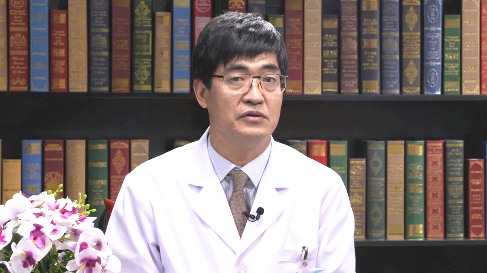

# 10.14 骨结核

---

## 秦世炳 主任医师

首都医科大学附属北京胸科医院骨科主任 主任医师。

中国防痨协会骨结核专业委员会分会主任委员；中华医学会结核病学分会骨关节结核专委会副主任委员；中国康复医学会脊柱脊髓感染学组副主任委员；中国医药教育协会骨科专委会脊柱分会脊柱感染教育工作组副主任委员；《中国防痨杂志》副主编。

**主要成就：** 近30年一直从事脊柱结核、关节结核和其它部位骨结核的诊治和研究；发表骨结核专业论文60余篇；承担北京科委脊柱结核重大临床科研项目，每年举办多次全国骨关节结核有很大影响力的会议和学习班。

**专业特长：** 擅长复发复治的、耐药的、难治的脊柱或关节结核的诊治，对其有着独特的见解；每年做骨结核手术500余例，脊柱结核300余例，是全国多家医院或特聘的会诊专家，指导和促进行业发展和进步。

---
