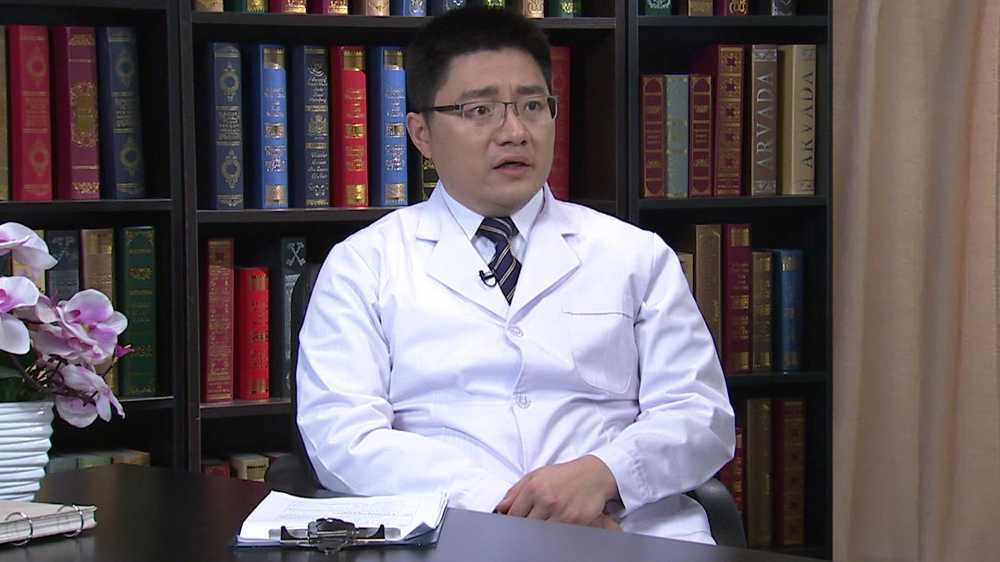

# 10.15 骨外科术后排气、通便的治疗

---

## 徐海林 主任医师

北京大学人民医院创伤骨科主任医师。

中华医学会骨科学分会足踝外科学组秘书长；中国医师协会骨科医师分会足踝工作委员会副主任委员；北京医学会骨科分会足踝学组副组长；国际内固定学会（AO）讲师；《中国矫形外科杂志》编委；《中国骨与关节外科杂志》编委；《中华医学杂志英文版》审稿专家；《中华骨科杂志》审稿专家；《中华创伤骨科杂志》审稿专家。

**主要成就** ：参编参译多本学术专著，是第四版骨科权威著作《骨与关节损伤》的编委，在国际国内的核心期刊上发表30余篇学术著作。

**专业特长** ：擅长足踝外科、创伤骨科、糖尿病足的诊治。曾先后在瑞士、法国、美国著名的足踝中心担任访问学者，在足踝部骨折、畸形、运动创伤的诊断治疗上具有丰富的临床经验和较深的造诣，多次在国内外足踝领域的学术会议上担任讲课专家和主持，是足踝外科领域的知名专家。

---
