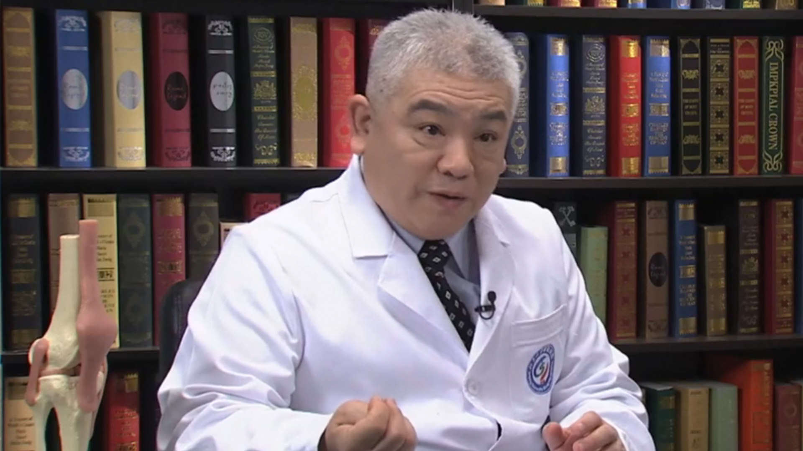

# 10.18 骨性关节炎

---

## 张光武 主任医师

北京大学首钢医院骨科主任 主任医师 硕士研究生导师。

北京医学会骨科分会委员；北京医学会创伤学分会委员；中国科普作家协会会员；北京市科普作家协会会员；北京写作学会京西分会副会长。

**主要成就：** 发表论文50余篇；主编及编著《骨质疏松及骨质增生防治》《骨质增生自我防治》《颈椎病自我防治》等书籍20部；“常见骨与关节疾病防治知识系列科普读物”获2014年度“北京市科学技术奖三等奖”；“骨科常见疾病防治知识系列科普读物”获2015年“中华医学科技奖医学科普奖”。

**专业特长：** 长期从事创伤骨科、关节外科、脊柱外科、骨质疏松等疾病的临床治疗、教学、科研、预防、科普等工作。

---
