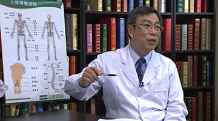

# 10.31 颈性眩晕

---

## 李中实主任医师

中日友好医院脊柱外科主任 主任医师 医学博士。

中华医学会骨科分会委员；中华医学会骨科分会脊柱外科学组委员；中华医学会北京分会骨科专业委员会常务委员；北京医师协会眩晕专家委员会主任委员；中国康复医学会颈椎病委员会副主任委员；中国康复医学会颈椎病专业委员会眩晕学组组长；中国康复医学会脊髓损伤委员会常务委员；《中国脊柱脊髓杂志》主编。

**专业特长：** 擅长脊柱微创手术；经皮激光椎间盘减压术（PLDD）；椎管减压；融合；内固定手术；脊柱矫形及重建手术；脊柱肿瘤及腰椎；颈椎手术失败翻修等手术。成功地完成了1600余例高难度的颈、胸、腰椎手术，取得满意得疗效。

---
