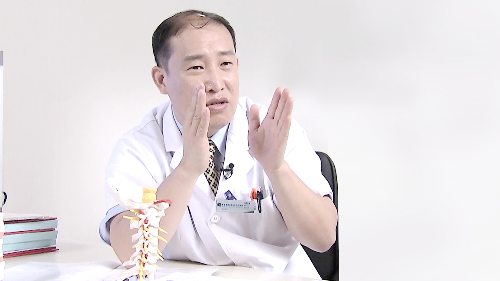

# 10.35 颈椎病//张智海教授

---

## 张智海 主任医师

中国中医科学院广安门医院骨科主任医师。

国家医学核心杂志《中国骨质疏松杂志》副主编；中国老年学学会骨质疏松委员会青委会副主任委员；中国医疗保健国际交流促进会脊柱侧凸研究分会委员；中华医学会北京骨科学会感染学组委员；北京中西医结合学会骨科委员会委员。

**主要成就：** 发表专业论文70余篇；《骨内科学》《骨矿与临床》《骨质疏松诊断》《现代创伤诊治与康复》《骨肿瘤的基础与临床研究》《综合征性脊柱侧凸的诊断与治疗》《骨代谢实验诊断》《医学论文写作与案例分析》骨科书籍副主编或编委；获得国家实用新型专利2项。

**专业擅长：** 擅长各种脊柱疾病的诊断与手术治疗，如退变性和先天性颈胸腰椎疾病、颈椎病、脊柱感染与肿瘤、腰椎滑脱或狭窄、脊柱创伤、脊柱侧弯等，严重脊柱侧弯的头盆环或HALO牵引及手术治疗、涉及骨与关节肌肉及软组织创伤与肿瘤等。

---
