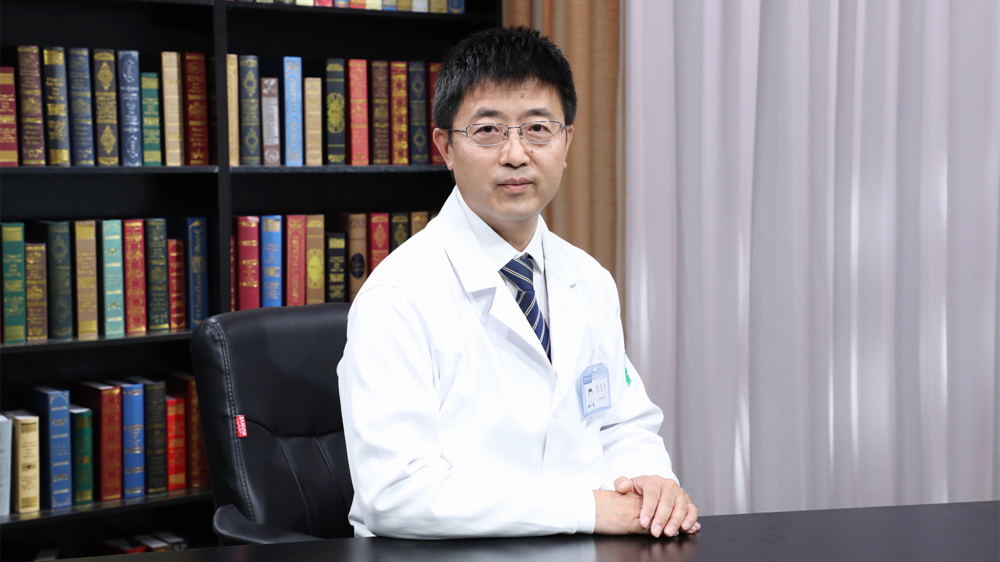

# 10.39 脊髓损伤

---

## 张庆民 主任医师

北大医疗康复医院院长 主任医师 康复医学与理疗学博士。

中欧工伤康复合作项目高级专家；中国人力资源与社会保障部工伤康复专家；全国工伤康复试点机构评审组专家；北京医学会物理医学与康复学分会常务委员；北京市工伤康复专家咨询委员会委员；中华中医药学会脊柱微创专家委员会常务委员。

**主要成就：** 参与编写《脊柱结核学》和《骨关节病康复学》；主导申请获得2013年度首都市民健康科研基金项目《脊髓损伤患者的生活质量与心理卫生问题的关系研究》；合作申请获得2006、2007年度首都医学发展科研基金资助项目《脊髓损伤患者早期膀胱处理对肾功能保护的临床研究》《多中心前瞻性脊髓损伤患者功能能力标准化评定研究》(重点支持项目)。

**专业特长：** 擅长脊柱脊髓损伤的康复治疗。

---
