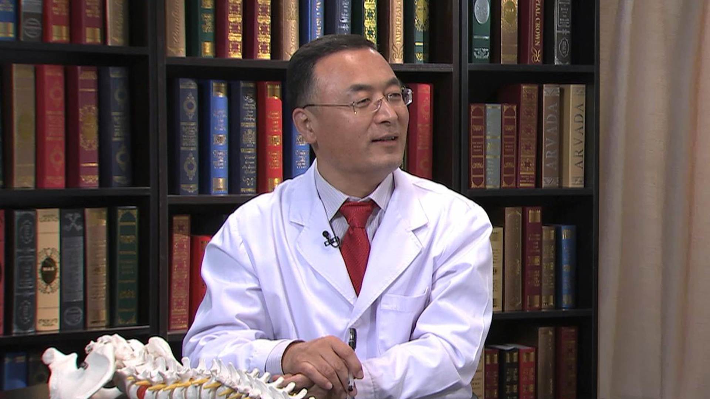

# 10.42 脊柱的日常保健

---

## 厉彦虎 主任医师

国家体育总局运动医学研究所医疗中心主任 主任医师 运动医学博士 硕士生导师。

中华中医药协会运动医学分会副秘书长；中国体育科学学会运动医学学会委员；中国中医药学会理事；国家体育总局百人计划成员；北京市东城区政协委员；民革中央大众健康专委会委员、教科文卫体委员。

**主要成就：** 参加国家体育总局奥运攻关课题11次；主持国家体育总局课题9次，科技部课题1次；获得奥运公关与科技服务二等奖一次，三等奖两次；2016年获得中国科协等九部委授予的“全民科学素质行动计划纲要”实施计划先进集体负责人；现在主持国家体育总局“青少年特发性脊柱侧弯的运动力学与康复体疗的研究”课题，运用青少年课间90秒牵拉操和纠正操对青少年脊柱侧弯进行治疗观察。

**专业特长：** 椎间盘源性脊柱关节紊乱的治疗和康复指导；治疗颈椎病、腰椎间盘突出及相关并发症；运动创伤的治疗与康复；青少年脊柱侧弯的治疗与康复指导。

---
