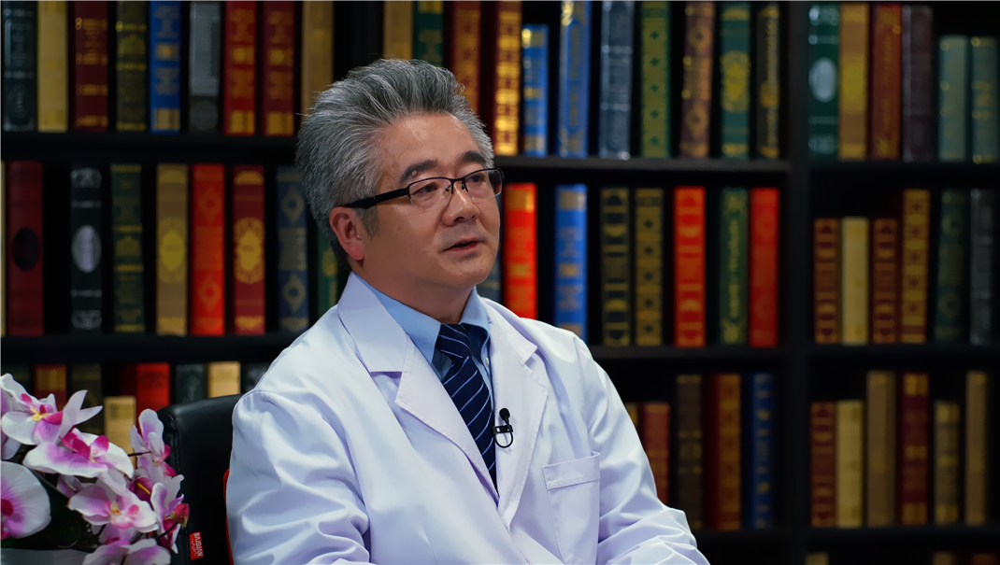

# 10.43 脊柱结核//马远征教授

---

## 马远征 主任医师

原解放军第三〇九医院全军骨科中心主任兼脊柱外科主任 主任医师 博士生导师。

中华医学会结核病学分会骨科专业委员会主任委员；中国老年学和老年医学学会骨质疏松分会主任委员；中国防痨协会结核病临床专业分会骨关节结核专业委员会副主任委员；中国康复医学会脊柱脊髓损伤专业委员会脊柱结核病学组副主任委员；北京医学会骨科学分会感染学组组长。

**主要成就：** 作为学科带头人，提出多学科专业交叉的“骨科综合诊疗模式”，在该理念推动下，医院的骨外科、骨内科转化医学基础科研，“四位一体”，骨科取得长足发展；荣获省部级医疗成果一等奖1项、二等奖3项、三等奖9项，获得多项国家专利，其中金奖1项，银奖2项；在国内外发表论文150余篇，主编、参编专著7部。

**专业特长：** 从事骨科临床与科研工作30年余，瞄准骨科诊治前沿，积极开展新业务并进行相关基础研究，擅长脊柱结核个体化综合诊疗、脊柱退行性病变阶梯性治疗、牵引提拉式脊柱滑脱一体化复位、脊柱非融合技术应用等，在脊柱外科领域具有较深造诣，同时在骨质疏松症基础研究与防控领域成果显著。

---
