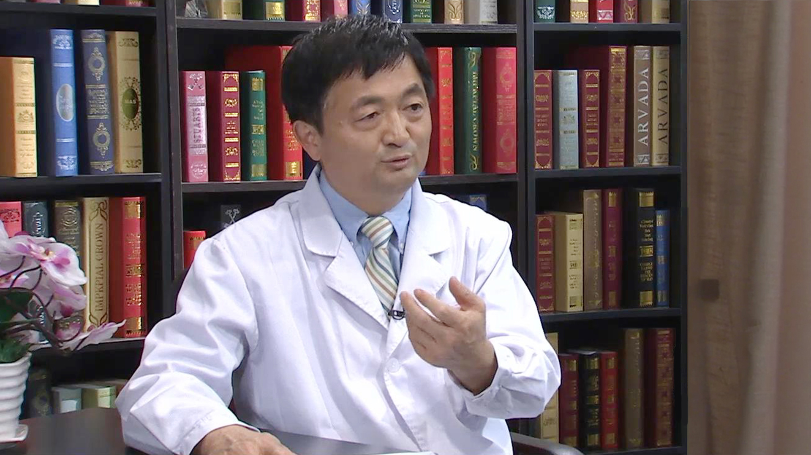

# 10.44 脊柱结核//苏庆军教授

---

## 苏庆军 主任医师

首都医科大学附属北京朝阳医院骨科 主任医师 硕士生导师。

中华医学会骨科学分会骨质疏松学组委员；中国医师协会骨科医师分会骨质疏松专业委员会委员；中国医师协会中西医结合医师分会脊柱伤病专家委员会委员；中国药学会医药信息专业委员会委员。

**主要成就：** 作为通讯作者在《The Spine Journal》、《Spine》、《International Orthopaedics》等杂志发表SCI论文6篇；
作为课题负责人和分课题负责人主持北京市和科技部课题3项。

**专业特长：** 擅长中老年脊柱骨折、骨质疏松、颈椎病、胸椎病、腰椎病、脊柱侧凸和脊柱半椎体畸形的诊治。尤其对骨质疏松性椎体压缩骨折和骨质疏松有深入的研究。

---
