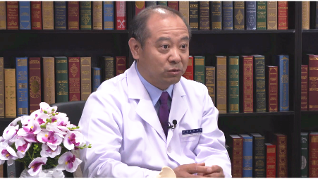

# 10.45 脊柱脊髓损伤

---

## 杨雍 主任医师

首都医科大学附属北京友谊医院骨科副主任 主任医师 硕士研究生导师 。

中华康复医学会脊柱脊髓损伤专业委员会委员；中国残疾人康复协会脊髓损伤康复专业委员会委员；国际脊髓学会中国脊髓损伤学会委员；中国康复医学会脊柱非融合学组委员；中国老年医学学会骨质疏松分会脊柱专委会委员。

**主要成就：** 发表脊柱脊髓相关科研论文50余篇，SCI论文10余篇；获得临床实用技术专利6项；承担省部级课题两项，其它课题多项。

**专业特长：** 擅长脊柱畸形、脊柱退行性疾病、脊柱创伤、脊椎肿瘤、骨质疏松性脊柱骨折等疾病的诊治，有丰富的临床经验。

---
