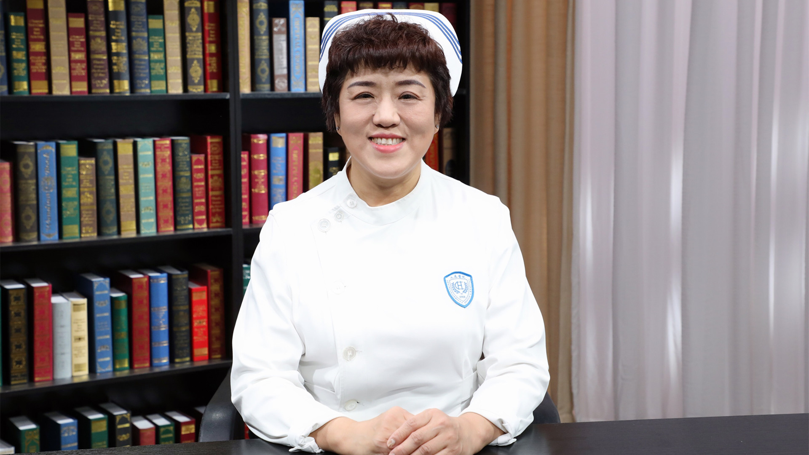

# 10.47 髋关节骨折并发症的预防

---

## 孔祥燕 副主任护师

北京大学人民医院护理部副主任。

中华护理学会骨科专业委员会委员；中华医学会创伤学分会护理学组常务委员；中华医学会骨科学分会护理学组委员；中国成人教育协会医学继续教育专业委员会外科护理学组副主任委员；北京中西医结合学会足踝医学专业委员会护理学组组长。

**主要成就：** 2015-2017年主持院内护理基金-“老年髋部骨折患者围手术期深静脉血栓的观察及防护”；2019-2020年主持院内护理基金-“规范化护理干预在创伤骨科住院患者深静脉血栓预防中的有效性研究”；以第一作者发表文章10篇（含会议论文2篇），以通讯作者发表文章8篇；作为副主编，出版专著《外科护理技术规范》，人民卫生出版社，53.3万字。

**专业特长：** 擅长护理质量管理、骨科护理、创伤后功能康复。

---
