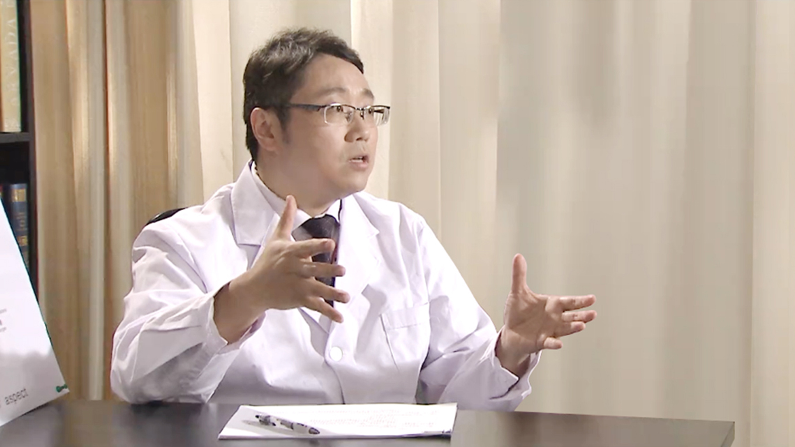

# 10.48 老年人骨折

---

## 张嘉 主任医师

北京协和医院骨科主任医师 副教授 硕士生导师 医学博士。

中华医学会骨科学分会骨质疏松学组委员；中华医学会骨质疏松及骨矿盐分会青年委员；中国康复医学会脊柱脊髓分会微创脊柱外科学组委员；国际创伤与矫形学会（SICOT）中国部委员；《中国矫形外科杂志》编委；《中国骨质疏松杂志》编委。

**主要成就：** 在国内外专业核心期刊发表论文20多篇，翻译国外学术专著3部。

**专业特长：** 擅长创伤骨科、骨质疏松症及骨质疏松骨折的诊疗。对于脊柱骨折的微创治疗、髋部骨折的手术治疗、腕部骨折的规范化治疗及老年人群的骨质疏松症防治有较深入的研究。

---
