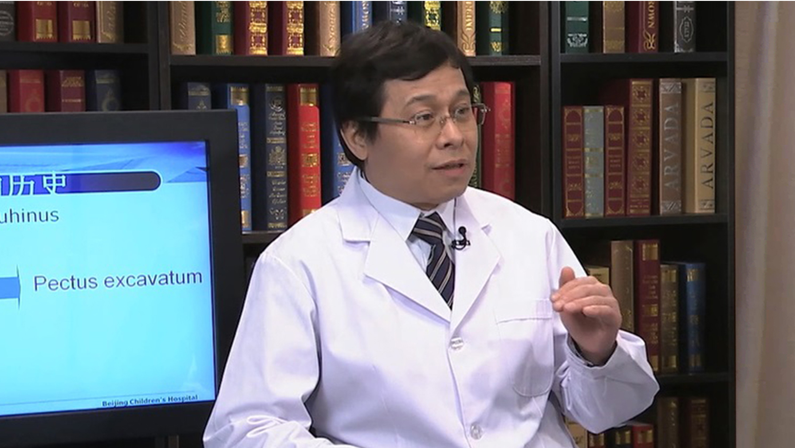

# 10.49 漏斗胸

---

## 曾骐 主任医师

首都医科大学附属北京儿童医院胸外科主任 主任医师 硕士研究生导师。

中国妇幼保健协会妇幼微创专业小儿胸外微创学组主任委员；中华医学会小儿外科分会内镜组副组长；中国医师协会胸外科分会纵隔及胸壁外科专家委员会副主任委员；首都医科大学胸外科学系副主任委员；《中华胸心血管外科杂志》编委；《中华小儿外科杂志》编委；《中国微创外科杂志》常务编委。

**主要成就：** 获批国家专利11项，其中发明专利2项；发表SCI论文4篇，中文核心期刊30余篇；主持省部级课题4项，局级课题1项；国际胸壁疾病组织（CWIG）中国唯一执行委员，胸壁矫形微创NUSS手术中国培训中心主任，美国BIOMET研发团队成员及国际培训医生。

**专业特长：** 国内为数不多专业从事小儿胸外科工作的专家之一。擅长复杂胸壁畸形、先天肺疾病、纵隔肿瘤等疾病的诊断和治疗，特别在漏斗胸微创手术、儿童胸腔镜微创技术方面有较高造诣。目前完成胸壁畸形微创手术量及技术水平居国际领先。

---
