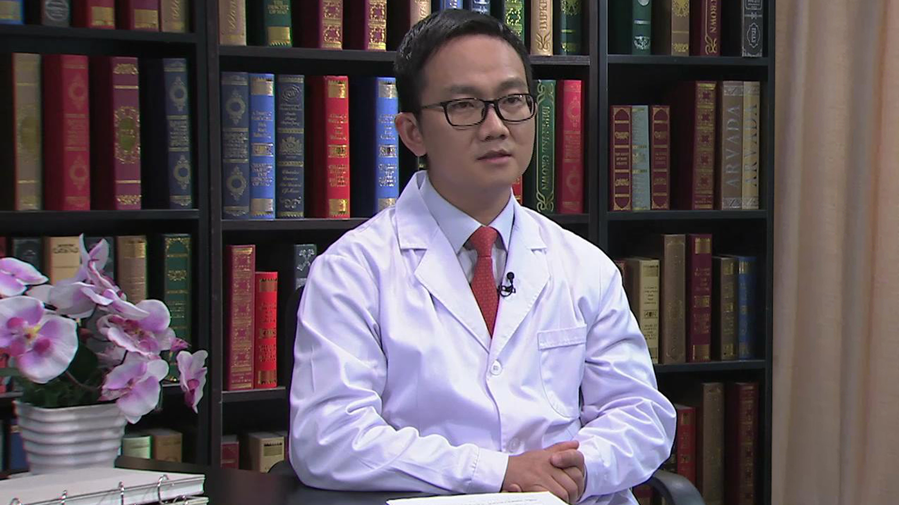

# 10.51 O型腿

---

## 杜辉 副主任医师

北京积水潭医院矫形骨科副主任医师 医学博士。

英国爱丁堡皇家外科学院院士（FRCSEd）；香港骨科医学院院士（FHKCOS）；中国中西医结合学会骨伤科分会外固定工作委员会委员；中国研究型医院学会冲击波医学专业委员会委员；"骨科在线"足踝专业编委会副主编。

**主要论文及编著：** 发表论文十余篇，其中SCI一篇；参与编写专业著作三本。

**专业特长**  **：** 擅长成人下肢畸形矫正：使用泰勒六轴空间外固定架和Ilizarov环架结合钢板、髓内钉内固定治疗下肢各类严重复杂畸形，包括膝内翻（O形腿）、膝外翻（X形腿）、踝关节内外翻、下肢骨折畸形愈合、下肢不等长、小儿麻痹、脊柱裂、脑瘫、侏儒症等。成人足踝部引起疼痛、畸形、肿胀、僵硬的各类疾病（不含肿瘤和三个月内的骨折）：包括拇外翻、拇僵症、跖痛症、平足、高弓足、马蹄足、跟腱炎、跟痛症、距骨坏死、踝关节关节炎、糖尿病足及各种足踝部严重复杂畸形。

---
