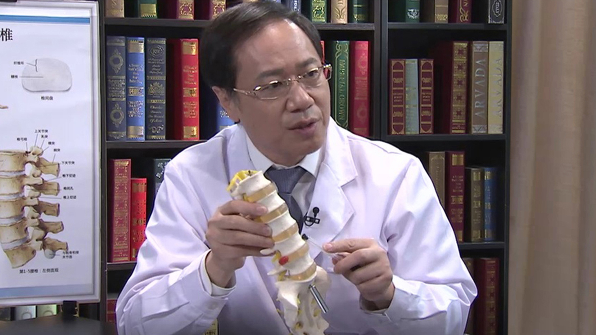

# 10.55 人工椎间盘置换术

---

## 鲁世保 主任医师

首都医科大学宣武医院骨科主任 主任医师 博士生导师 教授。

中国康复医学会脊柱脊髓损伤专业委员会委员；中国老年学学会老年脊柱关节疾病委员会委员；首都医科大学骨外科学系腰椎学组组长；《中华外科杂志》编委；《中国脊柱脊髓杂志》编委。

**主要成就：** 近三年发表中英论文20余篇，其中英文论文4篇，中文核心期刊近20篇；近三年申请国家自然基金项目1项，省部级课题4项。

**专业特长：** 致力于脊柱相关疾病的治疗研究，形成了以老年脊柱畸形矫正、颈腰椎非融合技术以及颈腰椎微创技术为特色的三位一体诊疗平台，提倡个体化阶梯治疗策略，包括微创技术（射频消融、椎间孔镜），非融合技术（后路动态稳定技术、颈腰椎人工椎间盘置换术）及融合术。擅长成人脊柱畸形矫正；胸椎管狭窄；脊柱肿瘤等复杂疾病的手术治疗有独到的见解。

---
