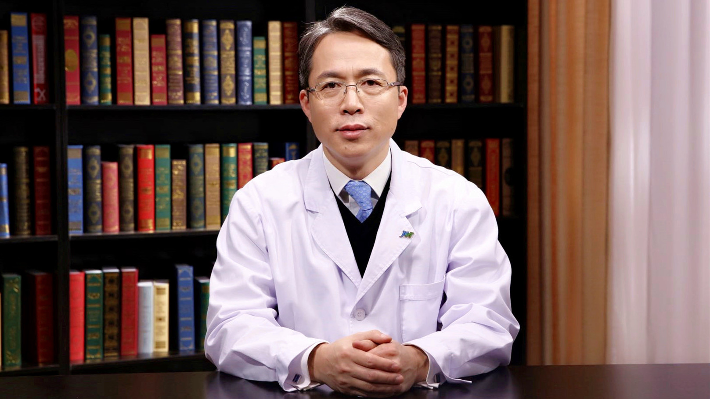

# 10.58 腕关节损伤与疾患

---

## 陈山林 主任医师

北京积水潭医院手外科行政负责人 主任医师；北京大学医学部骨科学系教授 医学博士 研究生导师。

亚太腕关节学会（APWA）首任及现任秘书长；亚太重建显微外科联盟（APFSRM）中国部常委；中华医学会手外科学分会常委；中华医学会显微外科学分会常委；中国医师协会显微外科医师分会副会长；中国医师协会肢体畸形修复专委会主任委员。

**学术成就：** 先后获得北京市委组织部优秀人才、十百千人才、215工程学科骨干、首发基金、首都临床特色等科研经费资助；国家重点专科手外科项目负责人；以第一作者、共同第一作者和通讯作者发表核心期刊论著55篇，SCI 论文10篇；主编主译专著7部；获得北京市科技进步二等奖和北京医学奖三等奖。

**专业擅长：** 先天手足畸形、腕关节损伤、周围神经损伤、手指再植与再造、各种游离皮瓣移植、骨缺损骨坏死、手部功能重建。在先天性拇指发育不良、先天性骨性融合、腕关节损伤的微创治疗、骨科机器人辅助腓骨移植治疗股骨头缺血坏死等领域均达到世界领先水平。

---
