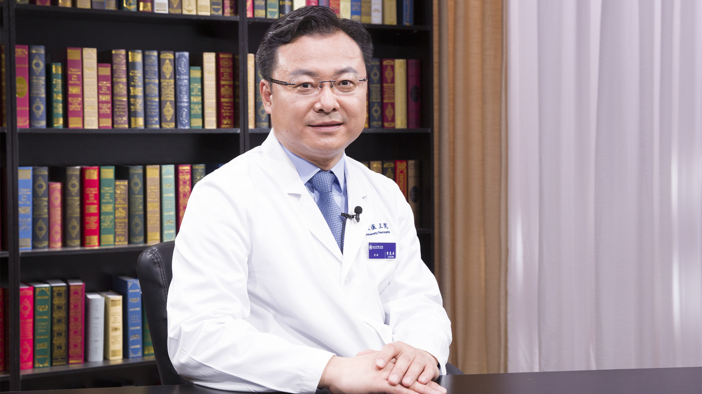

# 10.65 胸椎管狭窄症

---

## 李危石 主任医师

北京大学第三医院骨科主任 脊柱外科主任 主任医师 博士生导师 医学博士。

中国医药教育协会骨科专业委员会脊柱分会副主任委员；中华预防医学会脊柱疾病预防与控制专业委员会常委兼秘书长；中华医学会骨科学分会青年委员会脊柱学组副组长；北京医学会骨科学分会委员。

**主要成就：** 主持国家科技部重点研发项目1项，国家自然科学基金2项，省部级课题5项；发表论文40余篇。

**专业特长：** 擅长脊柱退行性疾病（腰椎管狭窄症、腰椎退变性侧弯、腰椎间盘突出症、腰椎滑脱、颈椎病）、脊柱畸形、胸椎管狭窄症等脊柱疾病的外科治疗及微创治疗。

---
