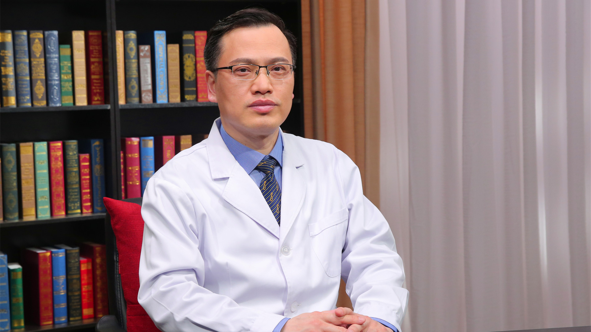

# 11.18 肺癌标志物的临床应用

---

## 时广利 主任检验师

首都医科大学附属北京胸科医院检验科主任 主任检验师 医学博士。

首都医科大学检验诊断学系委员；北京医学检验学会常务理事；北京中西医结合学会检验医学专业委员会委员；中国医学装备协会检验学会委员；中国生物医学工程学会医学检验分会委员；《中国医药导报杂志》审稿专家。

**主要成就：** 以项目负责人身份主持国家科技重大专项973子课题、国家863子课题、卫生局青年基金课题项目；入选“北京市通州区高层次人才发展计划”领军人才和北京市卫生系统高层次卫生技术人才；发表SCI文章8篇，中文核心期刊论文20余篇。

**专业特长：** 从事临床医学检验工作二十余年，擅长临床免疫学方面的临床检测和研究以及新型肿瘤标志物在肺癌辅助诊断、早期诊断、预后、疗效监测等方面的临床应用和研究，以及基因多态性与疾病易感性的相关性研究。

---
