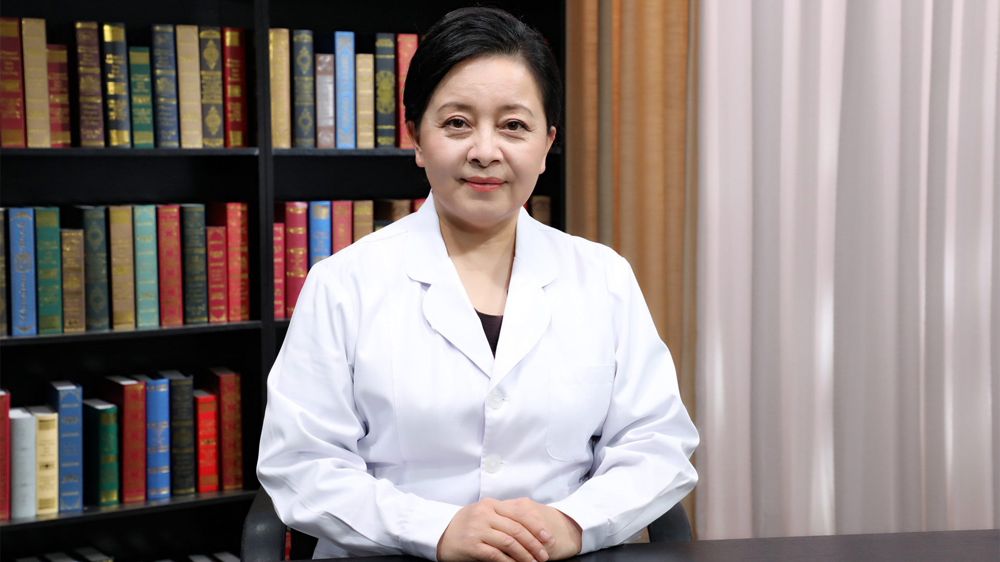

# 11.19 肺和胸腺神经内分泌肿瘤

---

## 依荷芭丽•迟 主任医师

中国医学科学院肿瘤医院肿瘤内科主任医师 教授 博士生导师。

中国医疗保健国际交流促进会理事；中国医疗保健国际交流促进会神经内分泌肿瘤分会（CNETS）副主任委员；中国临床肿瘤学会神经内分泌肿瘤专家委员会副主任委员；中国临床肿瘤学会肉瘤专家委员会委员；中国抗癌协会肉瘤专业委员会常务委员；中国抗癌协会胰腺癌专业委员会神经内分泌肿瘤学组副组长。

**主要成就：** 发表学术研究论文30余篇；负责和参与Ⅰ、Ⅱ、Ⅲ和Ⅳ临床研究30余项；参与2项安罗替尼治疗软组织肉瘤的多中心临床研究，于2016年和2018年ASCO会议口头报告，2020年ESMO会议mini口头报告。

**专业特长：** 擅长神经内分泌肿瘤、软组织肉瘤、消化系统肿瘤的内科治疗。

---
