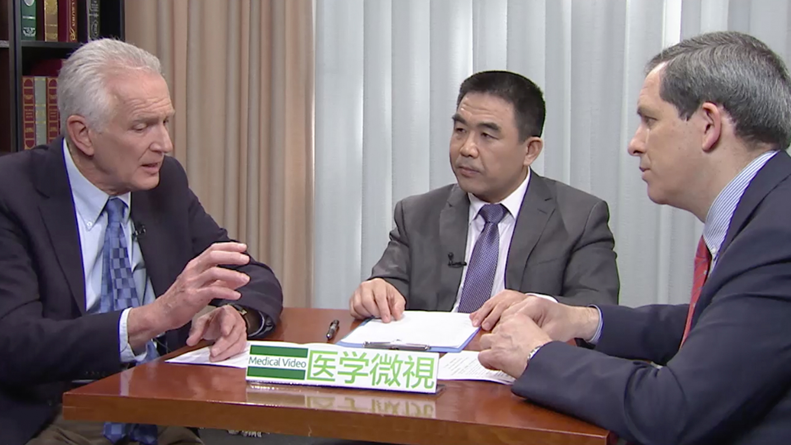

# 11.21 腹膜癌

---

## Dr. Paul H. Sugarbaker、Dr. Santiago González-Moreno、李雁 主任医师

**李雁：** 首都医科大学附属北京世纪坛医院肿瘤中心副主任 腹膜肿瘤外科主任 主任医师 博士生导师 教授。

国务院特殊津贴获得者；国际腹膜癌联盟（PSOGI）常委 ；美国临床肿瘤学会（ASCO）会员 ；国家科技进步一等奖获得者；教育部新世纪优秀人才 ；湖北省科技进步一等奖获得者 ;湖北省“人民好医生” ；CCTV最美医生之特别关注医生。

**主要成就：** 承担国家级科研项目18项；获发明专利6项；发表SCI论文130余篇，累计引用3300多次，合计IF>350。主持制定了中国腹膜癌治疗专家共识。

**专业特长：** 擅长腹膜表面肿瘤。

**Dr. Paul H. Sugarbaker** is the Director of Program in Peritoneal Surface Malignancy at Washington Hospital Center since 1993, Fellow of the American College of Surgeons and Fellow of the Royal College of Surgeons.

Paul H. Sugarbaker医生自1993年起担任华盛顿医院中心腹膜表面恶性肿瘤项目负责人，他还是美国外科学院院士和英国皇家外科学院院士。

Dr. Paul H. Sugarbaker is one of first generation pioneers in the field of peritoneal surface oncology, and has made great contribution to generalizing cytoreductive surgery and hyperthermic intraperitoneal chemotherapy in the treatment of peritoneal surface oncology, especially in pseudomyxoma peritonei and peritoneal malignant mesothelioma. He has published over 950 articles, reviews and books, invented and standardized the peritonectomy procedure and proposed peritoneal cancer index and completeness of cytoreductive, which are two most important independent prognostic factors in the field of peritoneal surface oncology, and are well known as PCI and CCR now.
Paul H. Sugarbaker医生是腹膜表面肿瘤研究领域最早的开创者之一，在肿瘤细胞减灭术和腹腔热灌注化疗治疗腹膜表面肿瘤这一技术体系的建立中做出了巨大的贡献，特别是对于腹膜假黏液瘤和腹膜恶性间皮瘤的治疗。他发表了超过950篇论著、综述和专著，提出并建立了全腹膜切除的标准流程，还团体提示了腹膜癌指数以及肿瘤细胞减灭程度评分，也就是我们如今所熟知的PCI和CCR评分，如今这两项评分是腹膜表面肿瘤领域最重要的两项独立预后因素。

**Dr. Santiago González-Moreno** , MD, PhD from Madrid, Spain, is the Medical Director and head of Department of Surgical Oncology at MD Anderson Cancer Center Madrid. He organizes the surgical oncology practice at MD Anderson Cancer Center Madrid since 2001, and serves a visiting assistant professor at the Department of Surgical Oncology in MD Anderson Cancer Center in Houston since 2005. Moreover, he serves as President of the Spanish Society of Surgical Oncology since 2013, and as the President of the Executive Committee of the European Society of Surgical Oncology recently.

Santiago González-Moreno医生，博士来自西班牙马德里，是马德里MD安德森癌症中心的医学总监以及肿瘤外科负责人。他自2001年起组建了马德里MD安德森癌症中心的肿瘤外科，自2005年起，他在休斯敦的MD安德森癌症中心的外科肿瘤学系担任客座助理教授。此外，自2013年起他担任西班牙外科肿瘤学会主席，近来又担任了欧洲外科肿瘤学会执行委员会主席。

Dr. Santiago González-Moreno was trained in gastrointestinal surgical oncology by Dr. Paul H. Sugarbaker at the Washington Cancer Institute in Washington DC where he focuses in peritoneal surface malignancy. Dr. González-Moreno´s areas of research interest include surgical practice, intraperitoneal chemotherapy and education of peritoneal carcinomatosis from colorectal cancer, gastric cancer, appendix cancer and abdominopelvic sarcomas. He has published articles, edited books and organized national and international scientific meetings on cytoreductive surgery and hyperthermic intraperitoneal chemotherapy for peritoneal carcinomatosis, and has lectured throughout Spain, Europe and South America on this topic.

Santiago González-Moreno医生曾在位于华盛顿的华盛顿癌症研究所跟随Paul H. Sugarbaker医生学习胃肠外科肿瘤学，并在此期间开始关注腹膜表面恶性肿瘤的研究。Dr. González-Moreno的研究方向包括外科技术、腹腔内化疗、以及来源于结直肠癌、胃癌、阑尾癌以及腹盆腔肉瘤的腹膜恶性肿瘤相关的教育项目。他发表了相关文章、主编教材并组织关于肿瘤细胞减灭术和腹腔热灌注化疗治疗腹膜癌的国家级甚至国际级学术会议，并就此主题，曾在西班牙、欧洲和南美洲进行演讲。

---
