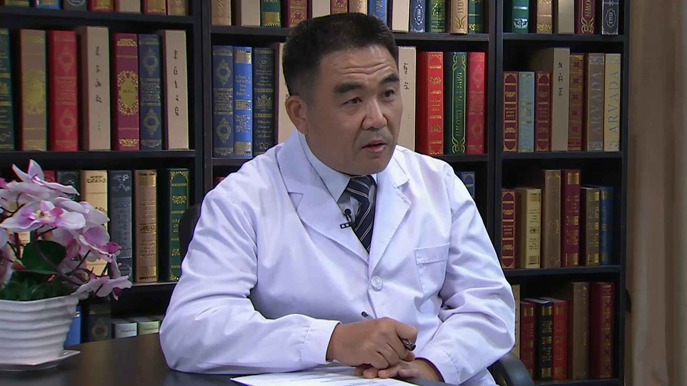

# 11.22 腹膜假黏液瘤

---

## 李雁 主任医师

首都医科大学附属北京世纪坛医院肿瘤中心副主任 腹膜肿瘤外科主任 主任医师 博士生导师 教授。

国务院特殊津贴获得者；国际腹膜癌联盟（PSOGI）常委 ；美国临床肿瘤学会（ASCO）会员 ；国家科技进步一等奖获得者；教育部新世纪优秀人才 ；湖北省科技进步一等奖获得者。

湖北省“人民好医生” ；CCTV最美医生之特别关注医生。

**主要成就：** 承担国家级科研项目18项；获发明专利6项；发表SCI论文130余篇，累计引用3300多次，合计IF>350。主持制定了中国腹膜癌治疗专家共识。

**专业特长：** 主要从事胃肠道肿瘤及腹膜后肿瘤诊疗，擅长胃癌；结直肠癌；特别是腹膜癌/腹膜后巨大、复发、疑难肿瘤以手术为主、配合腹腔热灌注化疗为辅的综合治疗，形成一整套腹膜癌/腹膜后肿瘤的规范化技术体系，取得良好效果。

---
