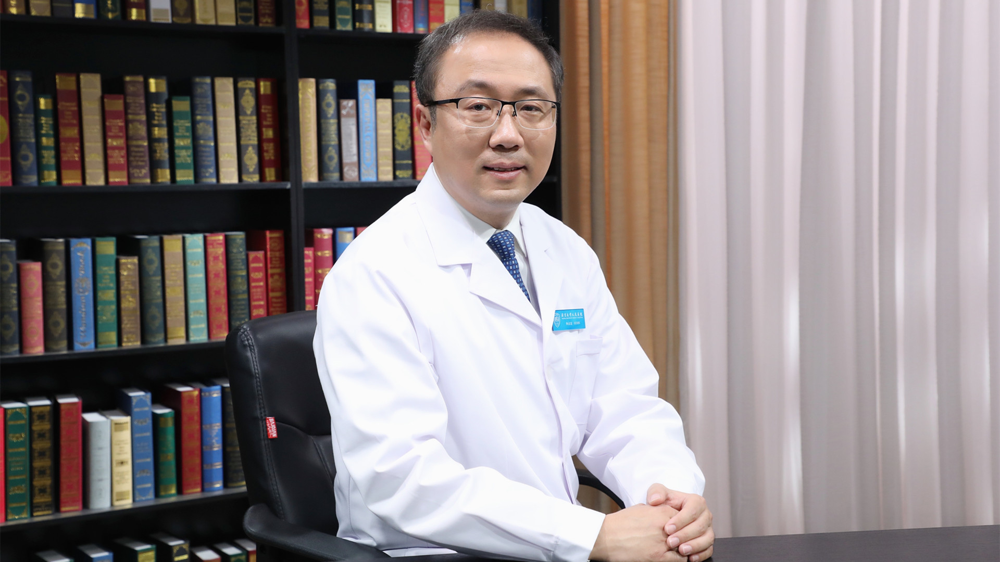

# 11.23 腹腔镜结肠癌根治术

---

## 申占龙 主任医师

北京大学人民医院胃肠外科主任医师 外科肿瘤研究室副主任 教授 医学博士 博士生导师。

中国医师协会外科医师分会taTME专业委员会副主任委员；中国医师协会外科医师分会MDT学组青年委员会主任委员；中国抗癌协会大肠癌专业委员会青年委员会副主任委员；中国性学会结直肠肛门功能外科分会副主任委员；中华医学会外科学分会实验外科学组委员；北京抗癌协会大肠癌专业委员会副主任委员。

**主要成就：** 以第一作者或通讯作者在 * Nature、Cell、PNAS* 、《中华外科杂志》等国际和国内知名期刊发表论文100余篇；主持多项国家级、省部级课题；获北京市科学技术奖一等奖、“敬佑生命•荣耀医者”青年创新奖、北京大学杰出青年医师奖、中国生物信息学十大进展、*Cell *杂志年度最佳文章等。

**专业特长：** 擅长胃肠肿瘤（结肠癌、直肠癌、胃癌等）的诊断与外科治疗，尤其是腹腔镜微创手术，包括腹腔镜结肠癌根治术、腹腔镜直肠癌根治术、直肠癌超低位保肛手术、早期直肠癌或巨大息肉经肛门微创手术、腹腔镜胃癌根治术。

---
