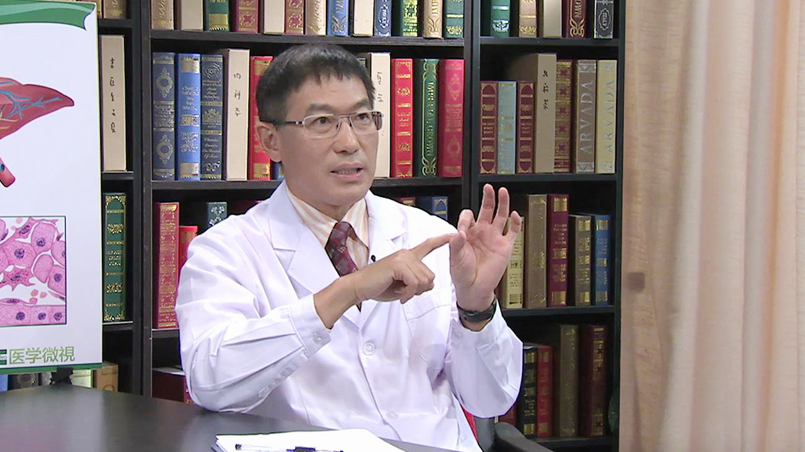

# 11.25 肝癌//张洪义教授

---

## 张洪义 主任医师

清华大学附属北京清华长庚医院肝胆胰中心执行主任 博士生导师。

中国研究型医院学会肝胆胰专业委员会副主委；中国科技部国家重点课题评审专家库成员；全军肝胆外科专业学组副主委；吴阶平医学基金会肿瘤微创介入治疗组副主委。

**主要成就：** 拥有国家 “十二五重大研究专项”等课题6项；获得国家及省部级医疗成果和科技成果奖二等奖4 项。

**专业特长：** 擅长肝脏恶性肿瘤的微创消融和介入治疗。主要在无血肝切除术；肝门部胆管癌根治术；腹腔镜下肝切除术；胰腺癌的综合治疗；腹腔镜下胰腺切除术；胆道微创治疗等方面具有鲜明的特色治疗，提出并建立了肝胆胰恶性肿瘤综合序贯治疗理论体系。

---
